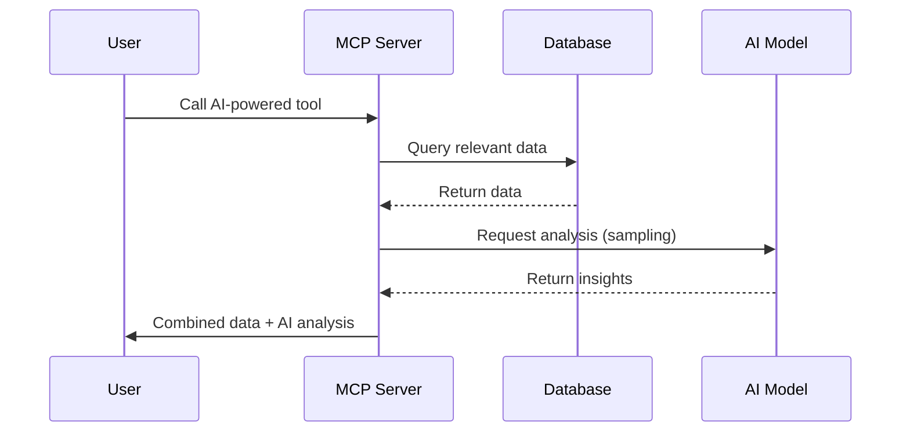

# AI-Powered Tools Overview

The server includes three AI-powered tools that use **MCP Sampling** to provide intelligent analysis and insights. These tools combine database queries with AI-assisted decision making to deliver actionable results.

## What Are AI-Powered Tools?

Unlike standard CRUD tools that simply return data, AI-powered tools:
- Fetch relevant data from the database
- Request AI analysis using **sampling**
- Combine raw data with AI insights
- Return comprehensive, actionable results

## Available Tools

### 1. Generate Intelligent Facility Report

**Tool Name:** `generate_intelligent_facility_report`

Creates comprehensive facility analysis reports with AI-generated health scores, risk assessments, and recommendations.

**Use Cases:**
- Monthly facility performance reviews
- Compliance audits
- Executive summaries
- Identifying areas needing attention

[**Full Documentation →**](./generate-facility-report.md)

### 2. Analyze Shipment Risk

**Tool Name:** `analyze_shipment_risk`

Performs AI-powered risk assessment for shipments based on contamination history and patterns.

**Use Cases:**
- Real-time shipment evaluation
- Risk-based inspection prioritization
- Source reliability assessment
- Incident investigation

[**Full Documentation →**](./analyze-shipment-risk.md)

### 3. Suggest Inspection Questions

**Tool Name:** `suggest_inspection_questions`

Generates customized inspection checklists based on facility history using AI elicitation.

**Use Cases:**
- Preparing for facility inspections
- Tailoring inspections to specific concerns
- Training new inspectors
- Standardizing inspection procedures

[**Full Documentation →**](./suggest-inspection-questions.md)

## How They Work



## Quick Example

### Using Inspector

1. **Open Inspector:**
   ```bash
   npx @modelcontextprotocol/inspector http://localhost:3000/sse
   ```

2. **Select Tool:** `generate_intelligent_facility_report`

3. **Provide Parameters:**
   ```json
   {
     "facilityId": "6905db9211cc522275d5f013",
     "includeRecommendations": true
   }
   ```

4. **Execute and Review Results**

### Using Direct API Call

```bash
curl -X POST http://localhost:3000/sse \
  -H "Content-Type: application/json" \
  -d '{
    "jsonrpc": "2.0",
    "method": "tools/call",
    "params": {
      "name": "generate_intelligent_facility_report",
      "arguments": {
        "facilityId": "6905db9211cc522275d5f013",
        "includeRecommendations": true
      }
    },
    "id": 1
  }'
```

## Response Format

All AI-powered tools return structured JSON with:

1. **Raw Data** - Database query results
2. **Calculated Metrics** - Computed statistics
3. **AI Analysis** - Generated insights and recommendations
4. **Metadata** - Timestamps, IDs, and processing info

## Performance

| Tool | Avg Response Time | Database Queries | AI Requests |
|------|-------------------|------------------|-------------|
| Facility Report | ~500ms | 4 | 1 |
| Shipment Risk | ~300ms | 3 | 1 |
| Inspection Questions | ~400ms | 4 | 2 |

## Error Handling

All tools include:
- ✅ Input validation with Zod schemas
- ✅ Graceful fallbacks if AI unavailable
- ✅ Clear error messages
- ✅ Timeout protection (30 seconds)
- ✅ Comprehensive logging

## Best Practices

### 1. Use Appropriate Tool for Task

- **Reports**: Use for comprehensive facility analysis
- **Risk Assessment**: Use for evaluating specific shipments
- **Questions**: Use when preparing inspections

### 2. Cache Results When Appropriate

AI analysis for the same data doesn't change frequently. Consider caching results for:
- Historical data analysis
- Recurring reports
- Training scenarios

### 3. Monitor Performance

Track:
- Response times
- AI request frequency
- Token usage (in production)
- Error rates

### 4. Handle Failures Gracefully

Even if AI analysis fails, tools return useful data:
```json
{
  "metrics": { "...": "..." },
  "aiAnalysis": {
    "error": "AI analysis unavailable",
    "fallbackScore": 45
  }
}
```

## Limitations

### Current Implementation

- **Mock AI**: Test environment uses pre-defined responses
- **Single Client**: Designed for one connected client
- **HTTP Transport**: Best with WebSocket for production

### Production Considerations

For production deployment:
1. Replace mock AI with real model integration
2. Implement response caching
3. Add rate limiting
4. Monitor token costs
5. Fine-tune prompts based on actual AI responses

## Learn More

- **[Sampling Guide](../../guides/sampling-guide.md)** - Detailed guide on MCP sampling
- **[MCP Features](../../mcp-features/sampling.md)** - Overview of sampling capabilities
- **[Examples](../../examples/ai-analysis.md)** - Complete workflow examples

## Support

Having issues?
- Check [Troubleshooting Guide](../../troubleshooting/common-issues.md)
- Review [Debug Guide](../../troubleshooting/debug-guide.md)
- Examine server logs for detailed error messages

---

**Next:** Choose a tool to learn more about its specific API and usage patterns.

