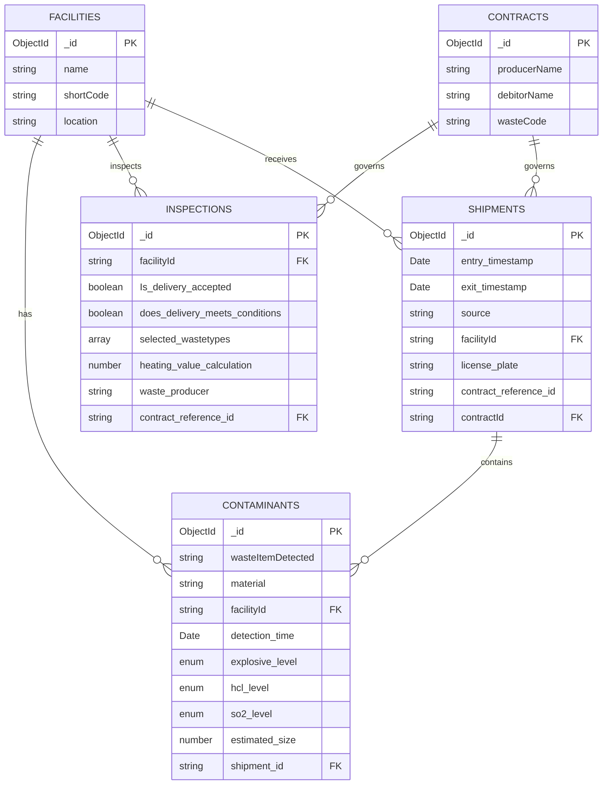

# Data Models

This page documents all data models (collections) in the MCP Server, their schemas, relationships, and constraints.

## Overview

The MCP Server manages five MongoDB collections with the following relationships:



## Facilities

### Purpose
Represent physical waste management facilities where waste is processed, inspected, and stored.

### Schema

```typescript
interface Facility {
  _id: ObjectId;           // Auto-generated MongoDB ID
  name: string;             // Full facility name
  shortCode: string;        // Short identifier (e.g., "CWM-001")
  location: string;         // Physical location
  __v: number;              // Mongoose version key
}
```

### Mongoose Schema

```typescript
const facilitySchema = new mongoose.Schema({
  name: { 
    type: String, 
    required: true 
  },
  shortCode: { 
    type: String, 
    required: true 
  },
  location: { 
    type: String, 
    required: true 
  },
});

export const Facility = mongoose.model('Facility', facilitySchema);
```

### Example Document

```json
{
  "_id": "67253a1b2e4f5c001d8e9a12",
  "name": "Central Waste Management Facility",
  "shortCode": "CWM-001",
  "location": "New York, NY",
  "__v": 0
}
```

### Field Descriptions

| Field | Type | Required | Description |
|-------|------|----------|-------------|
| `_id` | ObjectId | Yes (auto) | MongoDB unique identifier |
| `name` | String | Yes | Full name of the facility |
| `shortCode` | String | Yes | Short alphanumeric code for identification |
| `location` | String | Yes | Physical address or location description |

### Constraints

- All fields are required
- No unique constraints (multiple facilities can have similar names)
- No indexes defined (can be added for performance)

### Relationships

- **One-to-Many** with Contaminants (via `facilityId`)
- **One-to-Many** with Inspections (via `facilityId`)
- **One-to-Many** with Shipments (via `facilityId`)

---

## Contaminants

### Purpose
Track detected hazardous materials and contaminants found in waste shipments.

### Schema

```typescript
interface Contaminant {
  _id: ObjectId;
  wasteItemDetected: string;      // Description of contaminated item
  material: string;                // Material type
  facilityId: string;              // Reference to Facility
  detection_time?: Date;           // When detected (optional)
  explosive_level: 'low' | 'medium' | 'high';  // Explosive hazard level
  hcl_level: 'low' | 'medium' | 'high';        // HCl (acid) level
  so2_level: 'low' | 'medium' | 'high';        // SO2 (sulfur dioxide) level
  estimated_size: number;          // Size in cubic meters
  shipment_id: string;             // Reference to Shipment
  __v: number;
}
```

### Mongoose Schema

```typescript
const contaminantSchema = new mongoose.Schema({
  wasteItemDetected: { type: String, required: true },
  material: { type: String, required: true },
  facilityId: { type: String, required: true },
  detection_time: { type: Date },
  explosive_level: { 
    type: String, 
    enum: ['low', 'medium', 'high'], 
    required: true 
  },
  hcl_level: { 
    type: String, 
    enum: ['low', 'medium', 'high'], 
    required: true 
  },
  so2_level: { 
    type: String, 
    enum: ['low', 'medium', 'high'], 
    required: true 
  },
  estimated_size: { type: Number, required: true },
  shipment_id: { type: String, required: true },
});

export const Contaminant = mongoose.model('Contaminant', contaminantSchema);
```

### Example Document

```json
{
  "_id": "67253b2c3e5f6d002e9fab23",
  "wasteItemDetected": "Lithium-ion battery pack",
  "material": "Lithium-ion battery cells",
  "facilityId": "67253a1b2e4f5c001d8e9a12",
  "detection_time": "2025-11-01T08:30:00.000Z",
  "explosive_level": "high",
  "hcl_level": "low",
  "so2_level": "low",
  "estimated_size": 0.3,
  "shipment_id": "SHIP-2025-001",
  "__v": 0
}
```

### Field Descriptions

| Field | Type | Required | Description |
|-------|------|----------|-------------|
| `wasteItemDetected` | String | Yes | Description of the contaminated item |
| `material` | String | Yes | Material composition |
| `facilityId` | String | Yes | ID of facility where detected |
| `detection_time` | Date | No | ISO 8601 timestamp of detection |
| `explosive_level` | Enum | Yes | Explosive hazard: low, medium, high |
| `hcl_level` | Enum | Yes | Hydrochloric acid level |
| `so2_level` | Enum | Yes | Sulfur dioxide level |
| `estimated_size` | Number | Yes | Estimated volume in cubic meters |
| `shipment_id` | String | Yes | Reference to shipment |

### Constraints

- Enum values must be exactly: `"low"`, `"medium"`, or `"high"`
- `estimated_size` must be a positive number
- `facilityId` and `shipment_id` are strings (not enforced foreign keys)

### Relationships

- **Many-to-One** with Facilities (via `facilityId`)
- **Many-to-One** with Shipments (via `shipment_id`)

---

## Inspections

### Purpose
Record inspections of waste deliveries, including acceptance decisions and waste type analysis.

### Schema

```typescript
interface Inspection {
  _id: ObjectId;
  facilityId: string;
  Is_delivery_accepted: boolean;
  does_delivery_meets_conditions: boolean;
  selected_wastetypes: Array<{
    category: string;
    percentage: string;
  }>;
  heating_value_calculation: number;
  waste_producer: string;
  contract_reference_id: string;
  __v: number;
}
```

### Mongoose Schema

```typescript
const inspectionSchema = new mongoose.Schema({
  facilityId: { type: String, required: true },
  Is_delivery_accepted: { type: Boolean, required: true },
  does_delivery_meets_conditions: { type: Boolean, required: true },
  selected_wastetypes: [
    {
      category: { type: String, required: true },
      percentage: { type: String, required: true },
    },
  ],
  heating_value_calculation: { type: Number, required: true },
  waste_producer: { type: String, required: true },
  contract_reference_id: { type: String, required: true },
});

export const Inspection = mongoose.model('Inspection', inspectionSchema);
```

### Example Document

```json
{
  "_id": "67253c3d4f6g7e003fabbc34",
  "facilityId": "67253a1b2e4f5c001d8e9a12",
  "Is_delivery_accepted": true,
  "does_delivery_meets_conditions": true,
  "selected_wastetypes": [
    {
      "category": "Municipal Solid Waste",
      "percentage": "60"
    },
    {
      "category": "Commercial Waste",
      "percentage": "40"
    }
  ],
  "heating_value_calculation": 12500,
  "waste_producer": "Green Manufacturing Co.",
  "contract_reference_id": "WC-2025-001",
  "__v": 0
}
```

### Field Descriptions

| Field | Type | Required | Description |
|-------|------|----------|-------------|
| `facilityId` | String | Yes | ID of facility performing inspection |
| `Is_delivery_accepted` | Boolean | Yes | Was the delivery accepted? |
| `does_delivery_meets_conditions` | Boolean | Yes | Does delivery meet contract conditions? |
| `selected_wastetypes` | Array | Yes | Waste type breakdown |
| `selected_wastetypes[].category` | String | Yes | Waste category name |
| `selected_wastetypes[].percentage` | String | Yes | Percentage of this waste type |
| `heating_value_calculation` | Number | Yes | BTU or other heating value |
| `waste_producer` | String | Yes | Name of waste producer |
| `contract_reference_id` | String | Yes | Reference to contract |

### Constraints

- `selected_wastetypes` must be an array (can be empty)
- Percentages are strings (e.g., `"60"`, not `60`)
- Percentages should ideally sum to 100, but not enforced

### Relationships

- **Many-to-One** with Facilities (via `facilityId`)
- **Many-to-One** with Contracts (via `contract_reference_id`)

---

## Shipments

### Purpose
Track waste shipments from sources to facilities, including timestamps and vehicle information.

### Schema

```typescript
interface Shipment {
  _id: ObjectId;
  entry_timestamp: Date;
  exit_timestamp: Date;
  source: string;
  facilityId: string;
  license_plate: string;
  contract_reference_id: string;
  contractId: string;
  __v: number;
}
```

### Mongoose Schema

```typescript
const shipmentSchema = new mongoose.Schema({
  entry_timestamp: { type: Date, required: true },
  exit_timestamp: { type: Date, required: true },
  source: { type: String, required: true },
  facilityId: { type: String, required: true },
  license_plate: { type: String, required: true },
  contract_reference_id: { type: String, required: true },
  contractId: { type: String, required: true },
});

export const Shipment = mongoose.model('Shipment', shipmentSchema);
```

### Example Document

```json
{
  "_id": "67253d4e5g7h8f004gbccd45",
  "entry_timestamp": "2025-11-01T08:00:00.000Z",
  "exit_timestamp": "2025-11-01T08:45:00.000Z",
  "source": "Green Manufacturing Co. - Building A",
  "facilityId": "67253a1b2e4f5c001d8e9a12",
  "license_plate": "ABC-1234",
  "contract_reference_id": "WC-2025-001",
  "contractId": "67253b2c3e5f6d002e9fab23",
  "__v": 0
}
```

### Field Descriptions

| Field | Type | Required | Description |
|-------|------|----------|-------------|
| `entry_timestamp` | Date | Yes | When truck arrived (ISO 8601) |
| `exit_timestamp` | Date | Yes | When truck left (ISO 8601) |
| `source` | String | Yes | Origin of the shipment |
| `facilityId` | String | Yes | Destination facility ID |
| `license_plate` | String | Yes | Vehicle license plate |
| `contract_reference_id` | String | Yes | Contract reference code |
| `contractId` | String | Yes | MongoDB ObjectId of contract |

### Constraints

- Timestamps must be valid ISO 8601 dates
- `exit_timestamp` should be after `entry_timestamp` (not enforced)
- All string references are not foreign-key constrained

### Relationships

- **Many-to-One** with Facilities (via `facilityId`)
- **Many-to-One** with Contracts (via `contractId`)
- **One-to-Many** with Contaminants (via shipment reference)

---

## Contracts

### Purpose
Define agreements between waste producers and facilities/debtors.

### Schema

```typescript
interface Contract {
  _id: ObjectId;
  producerName: string;
  debitorName: string;
  wasteCode: string;
  __v: number;
}
```

### Mongoose Schema

```typescript
const contractSchema = new mongoose.Schema({
  producerName: { type: String, required: true },
  debitorName: { type: String, required: true },
  wasteCode: { type: String, required: true },
});

export const Contract = mongoose.model('Contract', contractSchema);
```

### Example Document

```json
{
  "_id": "67253e5f6h8i9g005hcdde56",
  "producerName": "Green Manufacturing Co.",
  "debitorName": "Central Waste Management Facility",
  "wasteCode": "WC-2025-001",
  "__v": 0
}
```

### Field Descriptions

| Field | Type | Required | Description |
|-------|------|----------|-------------|
| `producerName` | String | Yes | Company generating the waste |
| `debitorName` | String | Yes | Company/facility responsible for payment |
| `wasteCode` | String | Yes | Unique waste type/contract identifier |

### Constraints

- All fields are required
- No unique constraint on `wasteCode` (can be duplicated)

### Relationships

- **One-to-Many** with Inspections (via `contract_reference_id`)
- **One-to-Many** with Shipments (via `contractId`)

---

## Common Patterns

### MongoDB ObjectId

All documents have an `_id` field of type `ObjectId`:
- Auto-generated by MongoDB
- 24-character hexadecimal string
- Globally unique
- Contains embedded timestamp

**Example**: `"67253a1b2e4f5c001d8e9a12"`

### Mongoose Version Key

All documents have a `__v` field:
- Added by Mongoose automatically
- Tracks document version for optimistic concurrency
- Increments on updates

### Foreign Key Pattern

The server uses **string references** instead of MongoDB's `$ref`:
- Simpler implementation
- No enforced referential integrity
- Application-level validation
- Easier for MCP clients to work with

## Data Validation

### Server-Side Validation

**Two layers**:

1. **Zod Schemas** (input validation)
   ```typescript
   const createFacilitySchema = z.object({
     name: z.string(),
     shortCode: z.string(),
     location: z.string(),
   });
   ```

2. **Mongoose Schemas** (database validation)
   ```typescript
   {
     name: { type: String, required: true }
   }
   ```

### Client-Side Validation

Clients should validate:
- Required fields are present
- Enums match exact values
- Dates are in ISO 8601 format
- Numbers are valid
- Foreign key references exist

## Next Steps

- **[Request Flow](/architecture/request-flow)** - See how requests are processed
- **[API Reference](/api/overview)** - Explore CRUD operations for each model
- **[Examples](/examples/complete-workflows)** - See models in action

---

**Questions about data structure?** Check the [FAQ](/troubleshooting/faq).

