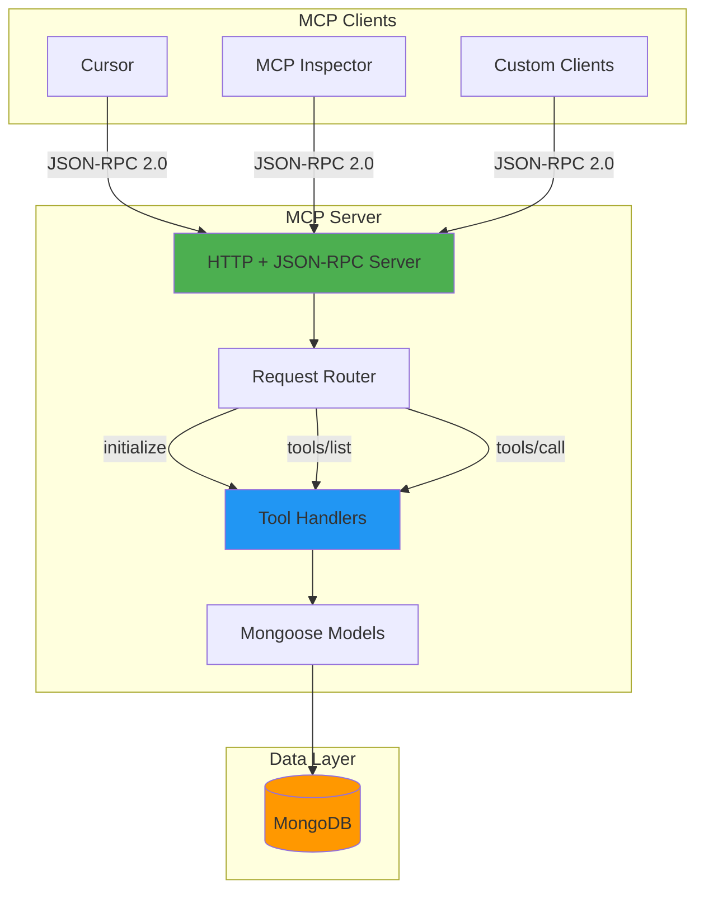
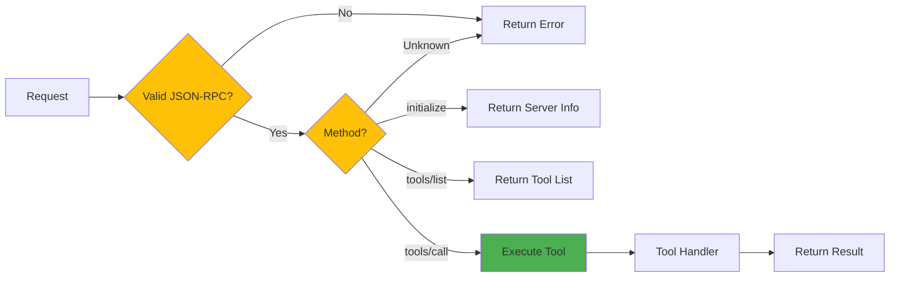
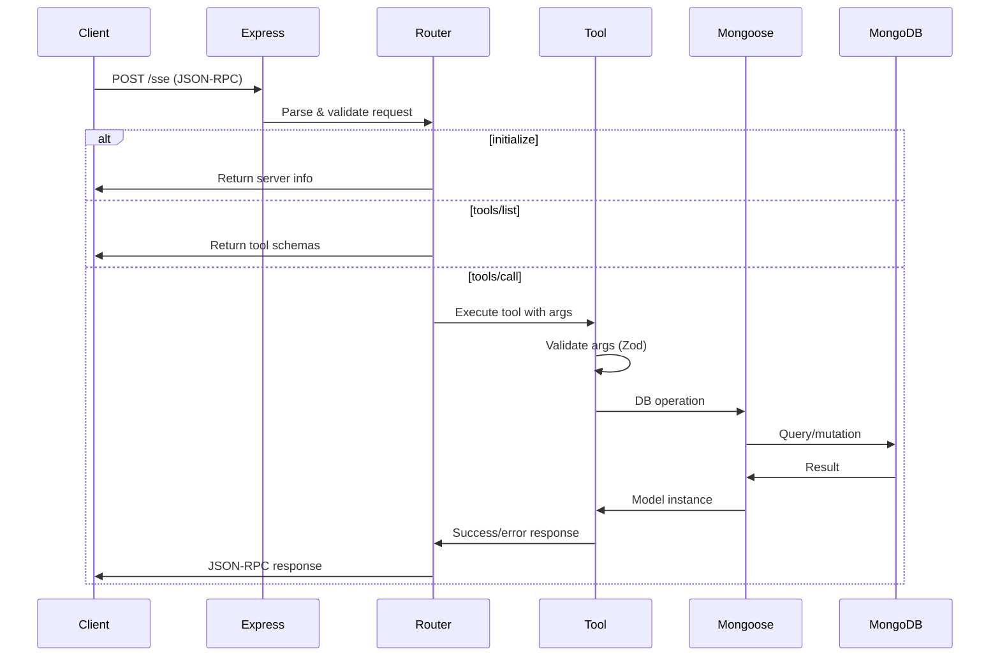
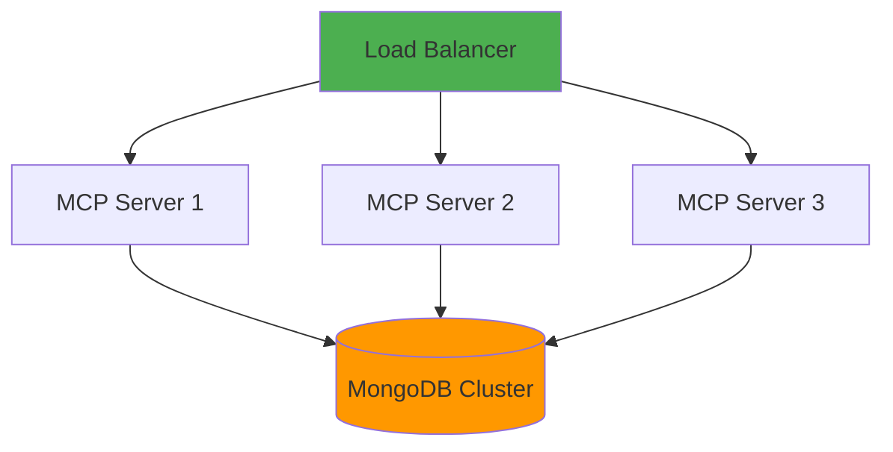
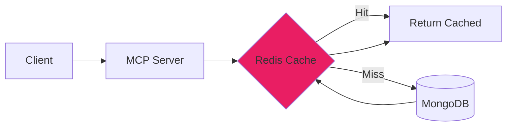
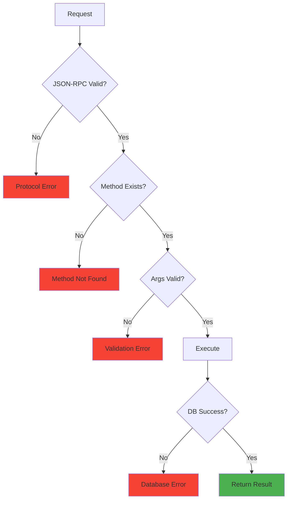

# Architecture Overview

This document explains the high-level architecture of the MCP Server, how components interact, and the design decisions behind the implementation.

## System Architecture

The MCP Server follows a clean, layered architecture:



## Key Components

### 1. HTTP Server (Express)

**Purpose**: Accept incoming HTTP requests from MCP clients.

**Responsibilities**:
- Listen on configured port (default: 3000)
- Parse JSON-RPC 2.0 requests
- Route requests to appropriate handlers
- Return JSON-RPC 2.0 responses
- Handle CORS for cross-origin requests

**Location**: `src/index.ts`

### 2. Request Router

**Purpose**: Dispatch JSON-RPC method calls to the correct handler.

**Supported Methods**:
- `initialize` - Handshake and capability negotiation
- `tools/list` - Return all available tools
- `tools/call` - Execute a specific tool

**Logic Flow**:


### 3. Tool Handlers

**Purpose**: Implement CRUD operations for each collection.

**Organization**:
- `src/tools/facilityTools.ts` - Facility operations
- `src/tools/contaminantTools.ts` - Contaminant operations
- `src/tools/inspectionTools.ts` - Inspection operations
- `src/tools/shipmentTools.ts` - Shipment operations
- `src/tools/contractTools.ts` - Contract operations

**Each Tool Has**:
- Zod schema for input validation
- JSON Schema for MCP protocol
- Async handler function
- Error handling

### 4. Mongoose Models

**Purpose**: Define data schemas and interact with MongoDB.

**Location**: `src/models/`

**Models**:
- `Facility` - Waste management facilities
- `Contaminant` - Detected hazardous materials
- `Inspection` - Facility inspections
- `Shipment` - Waste shipments
- `Contract` - Producer-facility contracts

### 5. MongoDB Database

**Purpose**: Persistent data storage.

**Collections**:
- `facilities` - Facility records
- `contaminants` - Contaminant detections
- `inspections` - Inspection records
- `shipments` - Shipment tracking
- `contracts` - Contract agreements

## Data Flow

### Complete Request Flow



### Example: Create Facility Flow

Let's trace a `create_facility` request:

1. **Client sends request**:
   ```json
   {
     "jsonrpc": "2.0",
     "id": 1,
     "method": "tools/call",
     "params": {
       "name": "create_facility",
       "arguments": {
         "name": "Test Facility",
         "shortCode": "TST-001",
         "location": "Test City"
       }
     }
   }
   ```

2. **Express receives** and parses JSON

3. **Router identifies** method is `tools/call`

4. **Tool handler** (`facilityTools.create_facility`):
   - Validates arguments with Zod schema
   - Calls `Facility.create(args)`

5. **Mongoose**:
   - Validates against schema
   - Inserts document into MongoDB

6. **MongoDB**:
   - Stores document
   - Returns inserted document with `_id`

7. **Response flows back**:
   ```json
   {
     "jsonrpc": "2.0",
     "result": {
       "content": [{
         "type": "text",
         "text": "{\"_id\":\"...\",\"name\":\"Test Facility\",...}"
       }]
     },
     "id": 1
   }
   ```

## Design Decisions

### Why HTTP + JSON-RPC?

**Alternatives Considered**:
- stdio transport (requires subprocess)
- WebSocket (complex for simple CRUD)

**Chosen**: HTTP + JSON-RPC 2.0

**Reasons**:
- ✅ Works over the internet
- ✅ Accessible from any HTTP client
- ✅ No special client configuration needed
- ✅ Easy to debug with `curl`
- ✅ Compatible with MCP Inspector
- ✅ Standard protocol with broad support

### Why Mongoose?

**Alternatives Considered**:
- Raw MongoDB driver
- Prisma
- TypeORM

**Chosen**: Mongoose

**Reasons**:
- ✅ MongoDB-native ODM
- ✅ Schema validation built-in
- ✅ Rich ecosystem
- ✅ TypeScript support
- ✅ Familiar to many developers
- ✅ Excellent documentation

### Why Zod?

**Alternatives Considered**:
- Joi
- Yup
- Pure TypeScript types

**Chosen**: Zod

**Reasons**:
- ✅ TypeScript-first design
- ✅ Runtime validation
- ✅ Converts to JSON Schema (needed for MCP)
- ✅ Type inference
- ✅ Excellent error messages
- ✅ Small bundle size

### Why Separate Tool Files?

**Alternative**: One large file with all tools

**Chosen**: Separate files per collection

**Reasons**:
- ✅ Better organization
- ✅ Easier to maintain
- ✅ Clearer responsibility
- ✅ Can be developed independently
- ✅ Easier to test

## Scalability Considerations

### Current Design

The current design is optimized for:
- **Development** and testing
- **Small to medium** deployments (< 10,000 requests/day)
- **Single server** deployment

### Scaling Up

For larger deployments, consider:

#### Horizontal Scaling



#### Caching Layer

Add Redis for frequently accessed data:



#### Database Optimization

- **Indexes**: Add indexes on frequently queried fields
- **Replication**: MongoDB replica sets for read scaling
- **Sharding**: For very large datasets

### Performance Characteristics

**Current Performance**:
- Response time: < 100ms (local)
- Throughput: ~1000 req/s (single server)
- Concurrent connections: ~1000

**Bottlenecks**:
- MongoDB query performance
- Network latency
- JSON serialization

## Security Considerations

### Current Security

The server currently has:
- ✅ Input validation (Zod schemas)
- ✅ MongoDB injection protection (Mongoose)
- ✅ CORS enabled
- ❌ No authentication
- ❌ No rate limiting
- ❌ No encryption

### Production Security

For production, add:

1. **Authentication**
   - API keys
   - OAuth 2.0
   - JWT tokens

2. **Rate Limiting**
   - Per-IP limits
   - Per-API-key limits

3. **Encryption**
   - HTTPS/TLS
   - Database encryption at rest

4. **Monitoring**
   - Request logging
   - Error tracking
   - Performance monitoring

## Error Handling Strategy

### Levels of Error Handling



### Error Response Format

All errors follow the MCP standard:

```json
{
  "jsonrpc": "2.0",
  "result": {
    "content": [{
      "type": "text",
      "text": "Error message here"
    }],
    "isError": true
  },
  "id": 1
}
```

## Logging Strategy

The server uses **Winston** for structured logging:

**Log Levels**:
- `error` - System errors, DB failures
- `warn` - Validation failures, unexpected inputs
- `info` - Request/response logging
- `debug` - Detailed execution flow

**Example Log**:
```
[INFO] 2025-11-01T10:00:00.000Z [MCP] Handling tools/call for: create_facility
[INFO] 2025-11-01T10:00:00.050Z [MCP] Tool execution successful
```

## Configuration Management

Configuration is loaded from environment variables via `.env`:

```typescript
export const config = {
  mongoUri: process.env.MONGODB_URI,
  port: parseInt(process.env.PORT || '3000'),
};
```

**Benefits**:
- Easy to change per environment
- Secure (secrets not in code)
- Standard practice

## Next Steps

Now that you understand the architecture:

1. **[Tech Stack](/architecture/tech-stack)** - Detailed technology breakdown
2. **[Data Models](/architecture/data-models)** - Schema definitions
3. **[Request Flow](/architecture/request-flow)** - Detailed request lifecycle
4. **[API Reference](/api/overview)** - Explore the tools

---

**Questions?** Check the [FAQ](/troubleshooting/faq) or [Troubleshooting Guide](/troubleshooting/common-issues).

