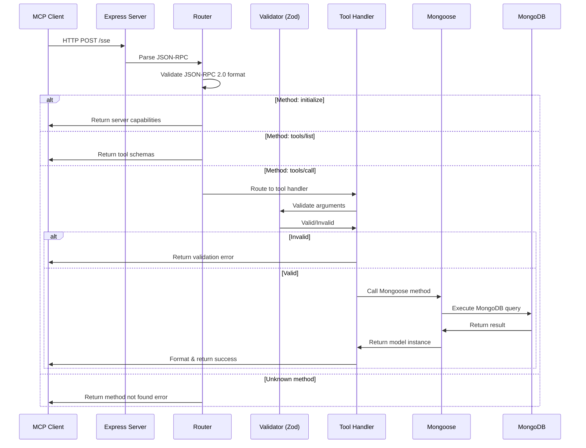
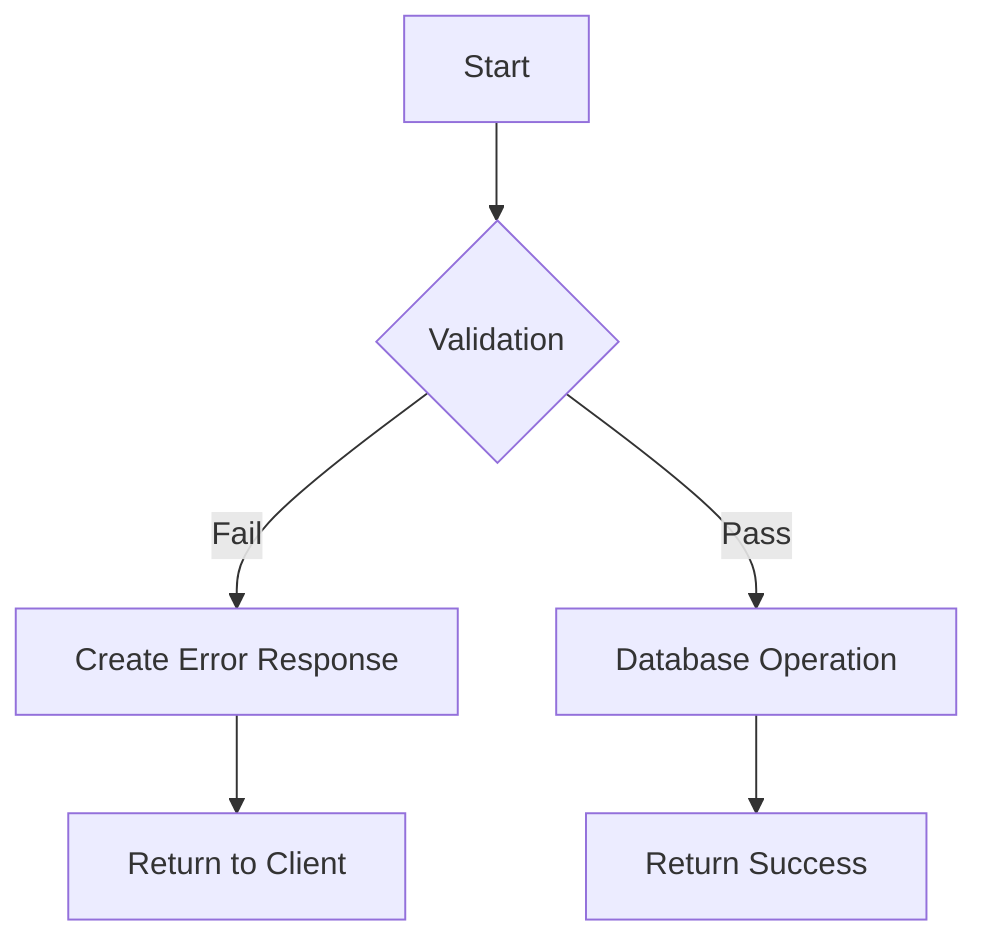

# Request Flow

This document provides a detailed walkthrough of how requests flow through the MCP Server, from client to database and back.

## Overview



## Phase 1: Client Request

### 1.1 Client Creates JSON-RPC Request

The client (Cursor, MCP Inspector, or custom) creates a JSON-RPC 2.0 request:

```json
{
  "jsonrpc": "2.0",
  "id": 1,
  "method": "tools/call",
  "params": {
    "name": "create_facility",
    "arguments": {
      "name": "Test Facility",
      "shortCode": "TST-001",
      "location": "Test City"
    }
  }
}
```

**Requirements**:
- `jsonrpc`: Must be `"2.0"`
- `id`: Unique request identifier (number or string)
- `method`: One of `initialize`, `tools/list`, or `tools/call`
- `params`: Method-specific parameters

### 1.2 Client Sends HTTP POST

```bash
curl -X POST http://localhost:3000/sse \
  -H "Content-Type: application/json" \
  -d '{ ... JSON-RPC request ... }'
```

**HTTP Details**:
- Method: `POST`
- URL: `/sse`
- Headers: `Content-Type: application/json`
- Body: JSON-RPC request

## Phase 2: Express Server Reception

### 2.1 Express Receives Request

```typescript
app.post('/sse', async (req: Request, res: Response) => {
  // Request handler starts here
});
```

**What Happens**:
1. Express matches route `/sse` with `POST` method
2. Parses JSON body (via `express.json()` middleware)
3. Creates `req` and `res` objects
4. Calls handler function

### 2.2 CORS Handling

```typescript
app.use(cors());
```

**What Happens**:
- Adds `Access-Control-Allow-Origin` header
- Allows cross-origin requests (for web clients)
- Handles preflight OPTIONS requests

### 2.3 Body Parsing

```typescript
app.use(express.json());
```

**What Happens**:
- Parses JSON body into `req.body`
- Validates JSON syntax
- Returns 400 if invalid JSON

## Phase 3: Request Routing

### 3.1 JSON-RPC Validation

```typescript
const { jsonrpc, id, method, params } = req.body;

if (jsonrpc !== '2.0') {
  return res.json({
    jsonrpc: '2.0',
    error: {
      code: -32600,
      message: 'Invalid Request'
    },
    id: null
  });
}
```

**Checks**:
- `jsonrpc` field exists and equals `"2.0"`
- `method` field exists
- `id` field exists

**Error Codes**:
- `-32600`: Invalid Request
- `-32601`: Method not found
- `-32603`: Internal error

### 3.2 Method Routing

```typescript
if (method === 'initialize') {
  // Handle initialize
} else if (method === 'tools/list') {
  // Handle tools/list
} else if (method === 'tools/call') {
  // Handle tools/call
} else {
  // Return method not found error
}
```

## Phase 4: Method-Specific Handling

### 4.1 Initialize Method

**Purpose**: Handshake and capability negotiation

**Request**:
```json
{
  "jsonrpc": "2.0",
  "id": 1,
  "method": "initialize",
  "params": {}
}
```

**Response**:
```json
{
  "jsonrpc": "2.0",
  "result": {
    "protocolVersion": "2024-11-05",
    "serverInfo": {
      "name": "waste-management-mcp-server",
      "version": "1.0.0"
    },
    "capabilities": {
      "tools": {}
    }
  },
  "id": 1
}
```

**Flow**:
1. Request received
2. Server info assembled
3. Response returned immediately
4. No database access

### 4.2 Tools/List Method

**Purpose**: Return all available tools with schemas

**Request**:
```json
{
  "jsonrpc": "2.0",
  "id": 2,
  "method": "tools/list",
  "params": {}
}
```

**Handler**:
```typescript
if (method === 'tools/list') {
  return res.json({
    jsonrpc: '2.0',
    result: {
      tools: Object.entries(allTools).map(([name, tool]) => ({
        name,
        description: tool.description,
        inputSchema: tool.inputSchema,
      })),
    },
    id,
  });
}
```

**Response**:
```json
{
  "jsonrpc": "2.0",
  "result": {
    "tools": [
      {
        "name": "create_facility",
        "description": "Create a new facility",
        "inputSchema": {
          "type": "object",
          "properties": { ... },
          "required": [ ... ]
        }
      },
      // ... 24 more tools
    ]
  },
  "id": 2
}
```

**Flow**:
1. Request received
2. `allTools` object iterated
3. Tool metadata extracted
4. Array of tools returned
5. No database access

### 4.3 Tools/Call Method

**Purpose**: Execute a specific tool

This is the most complex flow. Let's break it down step by step.

**Request**:
```json
{
  "jsonrpc": "2.0",
  "id": 3,
  "method": "tools/call",
  "params": {
    "name": "create_facility",
    "arguments": {
      "name": "Test Facility",
      "shortCode": "TST-001",
      "location": "Test City"
    }
  }
}
```

## Phase 5: Tool Execution (tools/call)

### 5.1 Tool Lookup

```typescript
const toolName = params?.name;
const tool = allTools[toolName as keyof typeof allTools];

if (!tool) {
  return res.json({
    jsonrpc: '2.0',
    result: {
      content: [{
        type: 'text',
        text: `Unknown tool: ${toolName}`
      }],
      isError: true
    },
    id
  });
}
```

**What Happens**:
- Tool name extracted from `params.name`
- Tool looked up in `allTools` object
- If not found, error returned

### 5.2 Argument Validation

```typescript
// Inside tool handler (e.g., facilityTools.create_facility)
const validatedArgs = createFacilitySchema.parse(args);
```

**Zod Validation**:
```typescript
const createFacilitySchema = z.object({
  name: z.string().describe('Facility name'),
  shortCode: z.string().describe('Short code'),
  location: z.string().describe('Location'),
});
```

**What Happens**:
- Arguments passed to Zod schema
- Schema validates each field:
  - Type checking (string, number, boolean, etc.)
  - Required fields
  - Custom validation rules
- If invalid, `ZodError` thrown
- Error caught and returned to client

**Validation Error Example**:
```json
{
  "jsonrpc": "2.0",
  "result": {
    "content": [{
      "type": "text",
      "text": "Error creating facility: Expected string, received number"
    }],
    "isError": true
  },
  "id": 3
}
```

### 5.3 Database Operation

```typescript
const facility = await Facility.create(validatedArgs);
```

**What Happens**:

1. **Mongoose Validation**
   ```typescript
   // Mongoose schema validates again
   {
     name: { type: String, required: true }
   }
   ```

2. **MongoDB Insert**
   ```javascript
   db.facilities.insertOne({
     name: "Test Facility",
     shortCode: "TST-001",
     location: "Test City"
   })
   ```

3. **Document Creation**
   - MongoDB generates `_id`
   - Mongoose adds `__v` (version key)
   - Timestamps added (if enabled)

4. **Result Returned**
   ```javascript
   {
     _id: ObjectId("67253a1b2e4f5c001d8e9a12"),
     name: "Test Facility",
     shortCode: "TST-001",
     location: "Test City",
     __v: 0
   }
   ```

### 5.4 Response Formatting

```typescript
return {
  content: [
    {
      type: 'text',
      text: JSON.stringify(facility, null, 2),
    },
  ],
};
```

**What Happens**:
- Mongoose document serialized to JSON
- Wrapped in MCP content format
- Returned to router

### 5.5 Final Response

```typescript
return res.json({
  jsonrpc: '2.0',
  result,
  id,
});
```

**Complete Response**:
```json
{
  "jsonrpc": "2.0",
  "result": {
    "content": [{
      "type": "text",
      "text": "{\"_id\":\"67253a1b2e4f5c001d8e9a12\",\"name\":\"Test Facility\",\"shortCode\":\"TST-001\",\"location\":\"Test City\",\"__v\":0}"
    }]
  },
  "id": 3
}
```

## Phase 6: Response to Client

### 6.1 HTTP Response

```typescript
res.json({ ... });
```

**What Happens**:
- Express serializes object to JSON
- Sets `Content-Type: application/json` header
- Sends HTTP 200 response
- Closes connection

### 6.2 Client Receives Response

**Client Actions**:
1. Receives HTTP response
2. Parses JSON body
3. Checks `id` matches request
4. Checks for `error` field
5. Extracts `result.content[0].text`
6. Parses inner JSON (if needed)
7. Uses data

## Error Handling Flow

### Error at Validation



**Example**:
```typescript
try {
  const validated = schema.parse(args);
} catch (error) {
  return {
    content: [{
      type: 'text',
      text: `Validation error: ${error.message}`
    }],
    isError: true
  };
}
```

### Error at Database

```typescript
try {
  const facility = await Facility.create(validatedArgs);
} catch (error: any) {
  return {
    content: [{
      type: 'text',
      text: `Error creating facility: ${error.message}`
    }],
    isError: true
  };
}
```

**Common Database Errors**:
- Duplicate key (`E11000`)
- Validation error
- Connection error
- Timeout

## Logging Throughout Flow

```typescript
logger.info('[MCP] Received JSON-RPC request:', req.body);
logger.info(`[MCP] Handling tools/call for: ${toolName}`);
logger.error(`[MCP] Error executing tool ${toolName}:`, error);
```

**What Gets Logged**:
- Request received (with body)
- Method being handled
- Tool being executed
- Errors (with stack traces)
- Database operations (optional)

## Performance Considerations

### Timing Breakdown

For a typical `create_facility` request:

1. **Network latency**: 1-50ms
2. **Express parsing**: < 1ms
3. **Routing**: < 1ms
4. **Validation**: 1-2ms
5. **Database insert**: 10-50ms (local), 50-200ms (remote)
6. **Response formatting**: < 1ms
7. **Network latency**: 1-50ms

**Total**: ~15-300ms depending on network and database location

### Optimization Opportunities

1. **Caching** - Cache `tools/list` response
2. **Connection Pooling** - Reuse MongoDB connections (already done by Mongoose)
3. **Validation** - Pre-compile Zod schemas (already done)
4. **Indexing** - Add MongoDB indexes for frequent queries
5. **Compression** - Enable gzip compression

## Next Steps

- **[API Reference](/api/overview)** - See all available tools
- **[Examples](/examples/complete-workflows)** - See complete workflows
- **[Troubleshooting](/troubleshooting/common-issues)** - Debug issues

---

**Questions about request flow?** See the [FAQ](/troubleshooting/faq).

