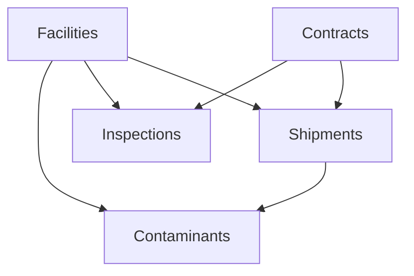

# First Steps

Now that you've [installed the server](/getting-started/installation) and completed the [Quick Start](/getting-started/quick-start), let's dive deeper into working with each collection.

This guide will walk you through creating and managing data across all five collections: Facilities, Contaminants, Inspections, Shipments, and Contracts.

## Understanding the Data Model

The MCP Server manages five interconnected collections:



- **Facilities** are independent (no dependencies)
- **Contaminants** link to Facilities and Shipments
- **Inspections** link to Facilities and Contracts
- **Shipments** link to Facilities and Contracts
- **Contracts** are independent

## Working with Facilities

Facilities are the core of the waste management system. They represent physical waste management locations.

### Create a Facility

```bash
curl -X POST http://localhost:3000/sse \
  -H "Content-Type: application/json" \
  -d '{
    "jsonrpc": "2.0",
    "id": 1,
    "method": "tools/call",
    "params": {
      "name": "create_facility",
      "arguments": {
        "name": "North Regional Processing Center",
        "shortCode": "NRPC-01",
        "location": "Seattle, WA"
      }
    }
  }'
```

**Response:**
```json
{
  "jsonrpc": "2.0",
  "result": {
    "content": [{
      "type": "text",
      "text": "{\"_id\":\"67253...\",\"name\":\"North Regional Processing Center\",\"shortCode\":\"NRPC-01\",\"location\":\"Seattle, WA\"}"
    }]
  },
  "id": 1
}
```

:::tip
**Save the `_id`!** You'll need it to create related records.
:::

### List All Facilities

```bash
curl -X POST http://localhost:3000/sse \
  -H "Content-Type: application/json" \
  -d '{
    "jsonrpc": "2.0",
    "id": 2,
    "method": "tools/call",
    "params": {
      "name": "list_facilities",
      "arguments": {}
    }
  }'
```

### Get a Specific Facility

```bash
curl -X POST http://localhost:3000/sse \
  -H "Content-Type: application/json" \
  -d '{
    "jsonrpc": "2.0",
    "id": 3,
    "method": "tools/call",
    "params": {
      "name": "get_facility",
      "arguments": {
        "id": "YOUR_FACILITY_ID"
      }
    }
  }'
```

## Working with Contracts

Contracts define agreements between waste producers and facilities.

### Create a Contract

```bash
curl -X POST http://localhost:3000/sse \
  -H "Content-Type: application/json" \
  -d '{
    "jsonrpc": "2.0",
    "id": 4,
    "method": "tools/call",
    "params": {
      "name": "create_contract",
      "arguments": {
        "producerName": "Green Manufacturing Co.",
        "debitorName": "North Regional Processing Center",
        "wasteCode": "WC-2025-001"
      }
    }
  }'
```

**Key Fields:**
- `producerName`: The company generating the waste
- `debitorName`: The facility or company responsible for payment
- `wasteCode`: Unique identifier for the waste type/contract

## Working with Shipments

Shipments track waste deliveries from sources to facilities.

### Create a Shipment

```bash
curl -X POST http://localhost:3000/sse \
  -H "Content-Type: application/json" \
  -d '{
    "jsonrpc": "2.0",
    "id": 5,
    "method": "tools/call",
    "params": {
      "name": "create_shipment",
      "arguments": {
        "entry_timestamp": "2025-11-01T08:00:00Z",
        "exit_timestamp": "2025-11-01T08:45:00Z",
        "source": "Green Manufacturing Co. - Building A",
        "facilityId": "YOUR_FACILITY_ID",
        "license_plate": "ABC-1234",
        "contract_reference_id": "WC-2025-001",
        "contractId": "YOUR_CONTRACT_ID"
      }
    }
  }'
```

**Key Fields:**
- `entry_timestamp`: When the truck arrived (ISO 8601 format)
- `exit_timestamp`: When the truck left
- `facilityId`: MongoDB ObjectId of the facility
- `contractId`: MongoDB ObjectId of the contract
- `license_plate`: Vehicle identification

:::info
**Timestamps**: Always use ISO 8601 format: `YYYY-MM-DDTHH:mm:ssZ`
:::

## Working with Contaminants

Contaminants track detected hazardous materials in shipments.

### Create a Contaminant Detection

```bash
curl -X POST http://localhost:3000/sse \
  -H "Content-Type: application/json" \
  -d '{
    "jsonrpc": "2.0",
    "id": 6,
    "method": "tools/call",
    "params": {
      "name": "create_contaminant",
      "arguments": {
        "wasteItemDetected": "Industrial chemical container",
        "material": "Steel container with chemical residue",
        "facilityId": "YOUR_FACILITY_ID",
        "detection_time": "2025-11-01T08:30:00Z",
        "explosive_level": "high",
        "hcl_level": "medium",
        "so2_level": "low",
        "estimated_size": 5.2,
        "shipment_id": "YOUR_SHIPMENT_ID"
      }
    }
  }'
```

**Hazard Levels:**
- `explosive_level`: `"low"`, `"medium"`, or `"high"`
- `hcl_level`: Hydrochloric acid level
- `so2_level`: Sulfur dioxide level

**Size:**
- `estimated_size`: Size in cubic meters (number)

## Working with Inspections

Inspections record facility compliance checks and waste deliveries.

### Create an Inspection

```bash
curl -X POST http://localhost:3000/sse \
  -H "Content-Type: application/json" \
  -d '{
    "jsonrpc": "2.0",
    "id": 7,
    "method": "tools/call",
    "params": {
      "name": "create_inspection",
      "arguments": {
        "facilityId": "YOUR_FACILITY_ID",
        "Is_delivery_accepted": true,
        "does_delivery_meets_conditions": true,
        "selected_wastetypes": [
          {
            "category": "Municipal Solid Waste",
            "percentage": "60"
          },
          {
            "category": "Commercial Waste",
            "percentage": "40"
          }
        ],
        "heating_value_calculation": 12500,
        "waste_producer": "Green Manufacturing Co.",
        "contract_reference_id": "WC-2025-001"
      }
    }
  }'
```

**Key Fields:**
- `Is_delivery_accepted`: Boolean - Was the delivery accepted?
- `does_delivery_meets_conditions`: Boolean - Did it meet contract conditions?
- `selected_wastetypes`: Array of objects with category and percentage
- `heating_value_calculation`: Number - BTU or other heating value
- `waste_producer`: String - Name of the waste producer
- `contract_reference_id`: String - Reference to the contract

:::warning
**Percentages**: Should be strings (e.g., `"60"`, not `60`), and should sum to 100% for best practices.
:::

## Complete Workflow Example

Here's a complete workflow from start to finish:

### 1. Create a Facility

```bash
# Create facility and save the ID
FACILITY_ID="67253a1b2e4f5c001d8e9a12"
```

### 2. Create a Contract

```bash
# Create contract and save the ID
CONTRACT_ID="67253b2c3e5f6d002e9fab23"
```

### 3. Create a Shipment

```bash
# Create shipment linking facility and contract
SHIPMENT_ID="67253c3d4f6g7e003fabbc34"
```

### 4. Perform an Inspection

```bash
# Inspect the delivery
curl -X POST http://localhost:3000/sse \
  -H "Content-Type: application/json" \
  -d "{
    \"jsonrpc\": \"2.0\",
    \"id\": 8,
    \"method\": \"tools/call\",
    \"params\": {
      \"name\": \"create_inspection\",
      \"arguments\": {
        \"facilityId\": \"$FACILITY_ID\",
        \"Is_delivery_accepted\": true,
        \"does_delivery_meets_conditions\": true,
        \"selected_wastetypes\": [{\"category\": \"MSW\", \"percentage\": \"100\"}],
        \"heating_value_calculation\": 11000,
        \"waste_producer\": \"Green Manufacturing Co.\",
        \"contract_reference_id\": \"WC-2025-001\"
      }
    }
  }"
```

### 5. Detect a Contaminant (if needed)

```bash
# If contaminant found during inspection
curl -X POST http://localhost:3000/sse \
  -H "Content-Type: application/json" \
  -d "{
    \"jsonrpc\": \"2.0\",
    \"id\": 9,
    \"method\": \"tools/call\",
    \"params\": {
      \"name\": \"create_contaminant\",
      \"arguments\": {
        \"wasteItemDetected\": \"Battery pack\",
        \"material\": \"Lithium-ion battery\",
        \"facilityId\": \"$FACILITY_ID\",
        \"explosive_level\": \"high\",
        \"hcl_level\": \"low\",
        \"so2_level\": \"low\",
        \"estimated_size\": 0.3,
        \"shipment_id\": \"$SHIPMENT_ID\"
      }
    }
  }"
```

## Updating Records

All collections support updates. Here's an example for updating a facility:

```bash
curl -X POST http://localhost:3000/sse \
  -H "Content-Type: application/json" \
  -d '{
    "jsonrpc": "2.0",
    "id": 10,
    "method": "tools/call",
    "params": {
      "name": "update_facility",
      "arguments": {
        "id": "YOUR_FACILITY_ID",
        "name": "North Regional Processing Center - Expanded",
        "location": "Seattle, WA - Industrial District"
      }
    }
  }'
```

:::tip
**Partial Updates**: You only need to include fields you want to change. Omitted fields remain unchanged.
:::

## Deleting Records

To delete a record:

```bash
curl -X POST http://localhost:3000/sse \
  -H "Content-Type: application/json" \
  -d '{
    "jsonrpc": "2.0",
    "id": 11,
    "method": "tools/call",
    "params": {
      "name": "delete_facility",
      "arguments": {
        "id": "YOUR_FACILITY_ID"
      }
    }
  }'
```

:::danger
**Cascade Delete**: The server does NOT automatically delete related records. If you delete a facility, contaminants, inspections, and shipments that reference it will have invalid `facilityId` values.
:::

## Best Practices

### 1. Always Validate IDs

Before creating related records, verify the parent record exists:

```bash
# Check if facility exists before creating inspection
curl -X POST http://localhost:3000/sse \
  -H "Content-Type: application/json" \
  -d '{
    "jsonrpc": "2.0",
    "id": 12,
    "method": "tools/call",
    "params": {
      "name": "get_facility",
      "arguments": {"id": "YOUR_FACILITY_ID"}
    }
  }'
```

### 2. Use Consistent Naming

Keep naming conventions consistent:
- **Short Codes**: `FACILITY-CODE-001`
- **Contract References**: `WC-YYYY-NNN`
- **License Plates**: Standard format for your region

### 3. Track Timestamps

Always use ISO 8601 timestamps for consistency:
```
2025-11-01T14:30:00Z  ← Correct
11/01/2025 2:30 PM    ← Incorrect
```

### 4. Monitor Hazard Levels

When creating contaminants, always specify all three hazard levels for complete tracking.

## Next Steps

Now that you understand the basics:

1. **[Architecture Overview](/architecture/overview)** - Understand the system design
2. **[API Reference](/api/overview)** - Detailed documentation for each tool
3. **[Complete Workflows](/examples/complete-workflows)** - Real-world scenarios
4. **[MCP Inspector Guide](/guides/mcp-inspector)** - Visual testing interface

## Common Patterns

### Batch Operations

To create multiple records, make multiple requests:

```bash
# Create multiple facilities in sequence
for name in "Facility A" "Facility B" "Facility C"; do
  curl -X POST http://localhost:3000/sse \
    -H "Content-Type: application/json" \
    -d "{
      \"jsonrpc\": \"2.0\",
      \"id\": $RANDOM,
      \"method\": \"tools/call\",
      \"params\": {
        \"name\": \"create_facility\",
        \"arguments\": {
          \"name\": \"$name\",
          \"shortCode\": \"FAC-$(date +%s)\",
          \"location\": \"Various\"
        }
      }
    }"
done
```

### Error Handling

Always check the `isError` field in responses:

```bash
response=$(curl -s -X POST http://localhost:3000/sse \
  -H "Content-Type: application/json" \
  -d '{"jsonrpc":"2.0","id":1,"method":"tools/call","params":{"name":"get_facility","arguments":{"id":"invalid"}}}')

if echo "$response" | jq -e '.result.isError' > /dev/null; then
  echo "Error occurred!"
  echo "$response" | jq '.result.content[0].text'
fi
```

---

**Ready to dive deeper?** Check out the [complete API reference](/api/overview) or explore [real-world workflows](/examples/complete-workflows).

