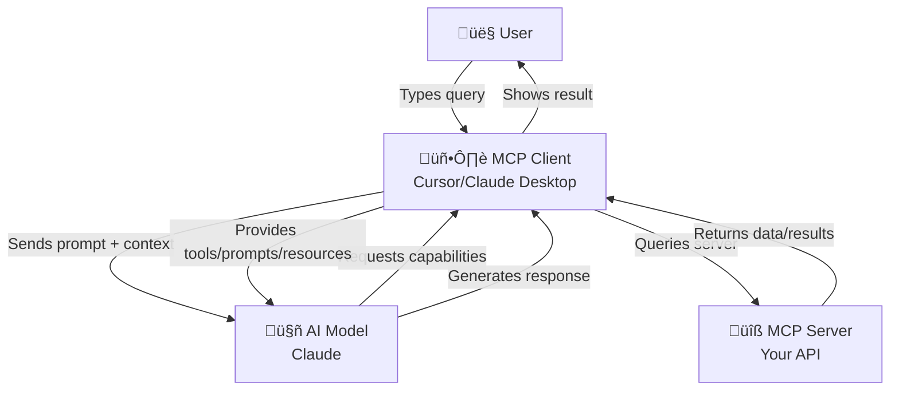
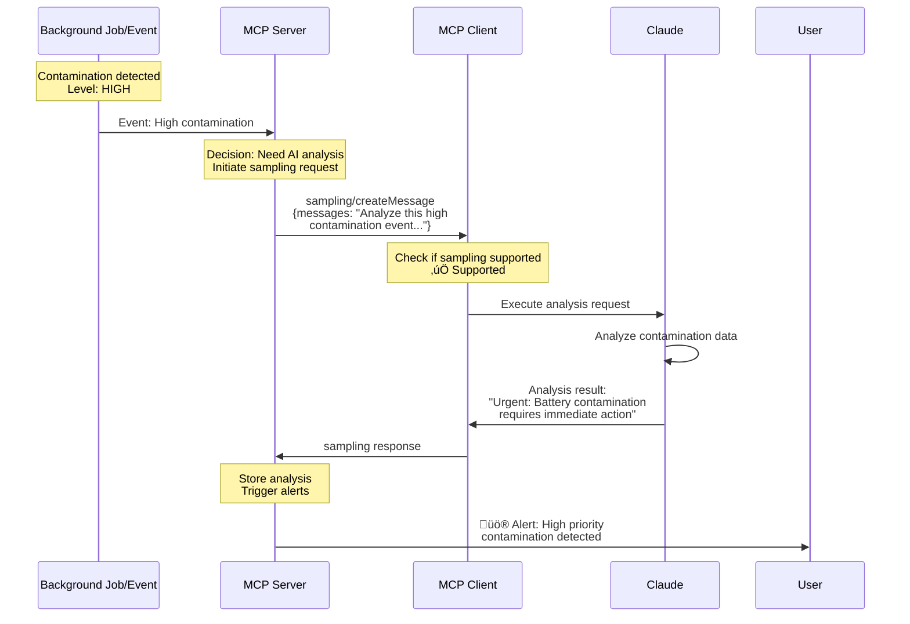
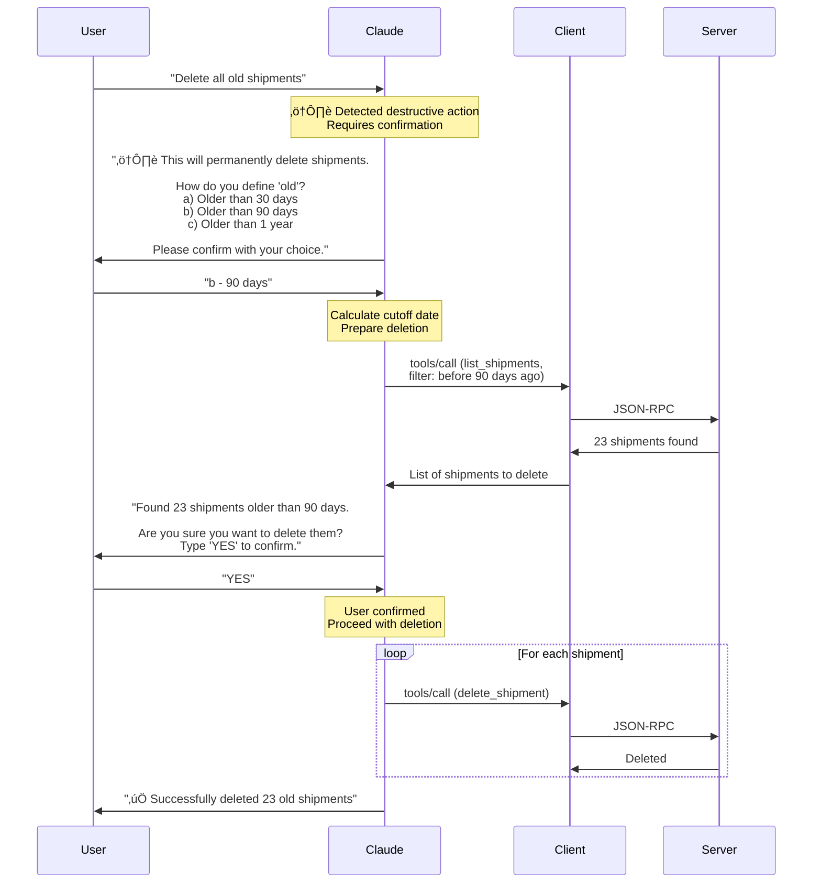

# MCP Client Execution Flow & AI Decision-Making

Learn how MCP clients orchestrate interactions between users, AI models, and your server, and how Claude generates intelligent execution plans for different query intents.

## Introduction

When you interact with an MCP-enabled application like Cursor or Claude Desktop, there's a sophisticated orchestration happening behind the scenes. This guide explains:

- How the **MCP client** acts as the orchestrator between you (the user), the AI model (Claude), and your MCP server
- How **Claude analyzes your intent** and decides which MCP features to use
- The **execution patterns** for different types of requests
- How to design your server to work optimally with AI decision-making

### The Three-Way Relationship



**Key Players:**

1. **User**: You, asking questions or requesting actions
2. **MCP Client** (Cursor/Claude Desktop): The orchestrator that:
   - Manages the connection to your MCP server
   - Discovers server capabilities (tools, prompts, resources)
   - Passes these capabilities to the AI model as context
   - Executes the AI's requested operations
3. **AI Model** (Claude): The intelligence that:
   - Understands your natural language query
   - Decides which server features to use
   - Plans the execution sequence
   - Interprets results and responds to you
4. **MCP Server**: Your backend that:
   - Advertises its capabilities
   - Executes tool calls
   - Provides resources for reading data
   - Offers prompts for common workflows
   - Can initiate sampling requests (advanced)

## MCP Features: A Quick Recap

Your MCP server can offer five types of capabilities:

### 1. Tools üîß
**Actions** that create, read, update, or delete data.

**Examples:**
- `create_facility`
- `list_contaminants`
- `update_shipment`
- `delete_inspection`

**When AI uses them:** For any action or query that modifies or retrieves specific data.

### 2. Prompts üìã
**Pre-defined workflow templates** that generate structured instructions for the AI.

**Examples:**
- `analyze-facility-compliance` (with facilityId, timeRange arguments)
- `generate-contamination-report` (with facilityId, includeRecommendations)

**When AI uses them:** When the user's request matches a known workflow pattern.

### 3. Resources üìö
**Read-only data endpoints** for quick information retrieval without tool execution.

**Examples:**
- `stats://overview` - System statistics
- `facility://list` - All facilities
- `facility://[id]` - Specific facility details
- `activity://recent` - Recent activity feed

**When AI uses them:** For fast read-only queries, especially for context-gathering before actions.

### 4. Sampling 🔄
**Server-initiated AI requests** where your server asks the AI to analyze or generate content.

**Examples:**
- Server detects anomaly ‚Üí requests AI analysis
- Scheduled job ‚Üí requests AI to generate weekly report
- Real-time event ‚Üí requests AI to classify urgency

**When to use:** For automated, server-driven intelligence.

### 5. Roots 📁
**File system access points** for reading/writing files (if your server exposes file operations).

**When AI uses them:** For file-based operations (less common in API servers).

## The Execution Flow Lifecycle

Here's what happens from the moment you type a message to getting a response:


## Query Intent Patterns

Claude analyzes your query and chooses an execution pattern. Here are the common patterns:

### Pattern 1: Information Retrieval (Resources)

**User Intent:** "Show me," "What is," "List all," "Get stats"

**AI Decision:** Use resources for fast, read-only access

**Example Query:** "Show me the system statistics"

**Execution Flow:**


**JSON-RPC Request:**
```json
{
  "jsonrpc": "2.0",
  "id": 1,
  "method": "resources/read",
  "params": {
    "uri": "stats://overview"
  }
}
```

**Response:**
```json
{
  "jsonrpc": "2.0",
  "result": {
    "contents": [{
      "uri": "stats://overview",
      "mimeType": "application/json",
      "text": "{\"overview\":{\"facilities\":5,\"contaminants\":142,...}}"
    }]
  },
  "id": 1
}
```

**Why this pattern:**
- ‚úÖ Fastest option (single request)
- ‚úÖ No tool execution overhead
- ‚úÖ Often cached by clients
- ‚úÖ Perfect for dashboards and overviews

**When to use resources:**
- Simple data retrieval
- System-wide statistics
- List of entities
- Dashboard data
- Recent activity feeds

---

### Pattern 2: Data Analysis with Context (Resources + Tools)

**User Intent:** "Analyze," "Show trends," "Compare"

**AI Decision:** Get context from resources first, then use tools for detailed queries

**Example Query:** "Analyze contamination trends for facility HAN"

**Execution Flow:**


**Why this pattern:**
- ‚úÖ Resources provide quick context (facility name, basic stats)
- ‚úÖ Tools provide detailed data for analysis
- ‚úÖ Optimizes performance (fast resource read first)
- ‚úÖ AI can decide if tools are needed based on resource data

**Real Example:**

```json
// First: Get context quickly
{
  "method": "resources/read",
  "params": {"uri": "facility://6905db9211cc522275d5f013"}
}

// Returns: Facility metrics (acceptanceRate: 88.89%, totalContaminants: 12)

// Then: Get detailed data
{
  "method": "tools/call",
  "params": {
    "name": "list_contaminants",
    "arguments": {"facilityId": "6905db9211cc522275d5f013"}
  }
}

// Returns: Full contamination records with timestamps, severity, materials
```

---

### Pattern 3: Guided Workflows (Prompts + Tools)

**User Intent:** "I need to [do complex task]", "Help me [workflow]"

**AI Decision:** Use a prompt to get structured instructions, then execute tools accordingly

**Example Query:** "I need to analyze facility compliance"

**Execution Flow:**


**Prompt Instructions Returned:**

```json
{
  "result": {
    "description": "Analyze a facility's compliance...",
    "messages": [{
      "role": "user",
      "content": {
        "type": "text",
        "text": "Please analyze facility HAN...\n\nUse these tools:\n- get_facility\n- list_inspections\n- list_contaminants\n- list_shipments\n\nProvide:\n- Summary of findings\n- Key metrics\n- Areas of concern\n- Recommendations"
      }
    }]
  }
}
```

**Why this pattern:**
- ‚úÖ Ensures consistency (same analysis structure every time)
- ‚úÖ Reduces AI's cognitive load (pre-defined steps)
- ‚úÖ User-friendly (no need to specify exact tools)
- ‚úÖ Best for common, repeatable workflows

**When to create prompts:**
- Multi-step workflows that users repeat frequently
- Complex analyses requiring specific tool sequences
- Report generation with standard formats
- Compliance checks with required steps

---

### Pattern 4: Complex Multi-Step Tasks (Prompts + Resources + Tools)

**User Intent:** "Create a comprehensive report", "Full analysis"

**AI Decision:** Orchestrate all features for complete workflow

**Example Query:** "Create a comprehensive contamination report for facility HAN"

**Execution Flow:**


**Feature Combination:**

| Phase | Feature | Purpose |
|-------|---------|---------|
| 1 | Prompt | Get report structure and required sections |
| 2 | Resources | Quick context (system-wide stats, recent activity) |
| 3 | Tools | Detailed data (specific facility records) |
| 4 | AI Analysis | Compile everything into comprehensive report |

**Why this pattern:**
- ‚úÖ Most complete picture (uses all available features)
- ‚úÖ Optimized (resources for speed, tools for detail)
- ‚úÖ Structured (prompt ensures consistent format)
- ‚úÖ Context-aware (resources provide background)

---

### Pattern 5: Direct Actions (Tools Only)

**User Intent:** "Create," "Update," "Delete" (specific action)

**AI Decision:** Direct tool call (no prompt or resource needed)

**Example Query:** "Create a new facility called Berlin with code BER"

**Execution Flow:**


**JSON-RPC Request:**
```json
{
  "jsonrpc": "2.0",
  "id": 1,
  "method": "tools/call",
  "params": {
    "name": "create_facility",
    "arguments": {
      "name": "Berlin",
      "shortCode": "BER",
      "location": "Berlin, Germany"
    }
  }
}
```

**Why this pattern:**
- ‚úÖ Simplest and fastest
- ‚úÖ No overhead from prompts/resources
- ‚úÖ Clear single action
- ‚úÖ Immediate feedback

**When to use direct tools:**
- Simple CRUD operations
- User provides all required parameters
- No need for context or workflow structure
- Single-purpose actions

---

### Pattern 6: Server-Initiated Analysis (Sampling)

**User Intent:** None (server-initiated)

**Server Decision:** Detected event requiring AI analysis

**Example Trigger:** Server detects high contamination event

**Execution Flow:**



**Sampling Request:**

```json
{
  "jsonrpc": "2.0",
  "method": "sampling/createMessage",
  "params": {
    "messages": [{
      "role": "user",
      "content": {
        "type": "text",
        "text": "Analyze this contamination event:\n- Material: Lithium-Ion Battery\n- Explosive Level: HIGH\n- Detection Time: 2025-11-01T09:15:00Z\n- Facility: HAN\n\nProvide:\n1. Severity assessment\n2. Immediate actions required\n3. Risk factors"
      }
    }],
    "modelPreferences": {
      "hints": [{"name": "claude-3-5-sonnet-20241022"}]
    },
    "systemPrompt": "You are a waste management safety analyst.",
    "maxTokens": 1000
  }
}
```

**Why this pattern:**
- ‚úÖ Automated intelligence (no user prompt needed)
- ‚úÖ Real-time analysis of server events
- ‚úÖ Scheduled reporting (daily/weekly summaries)
- ‚úÖ Proactive monitoring and alerts

**Use cases:**
- Anomaly detection and analysis
- Automated compliance reporting
- Real-time safety assessments
- Scheduled summary generation
- Data quality checks

**Client Compatibility:**

| Client | Sampling Support |
|--------|------------------|
| Claude Desktop | ‚úÖ Yes (v0.5.0+) |
| Cursor | ‚ùì Check version |
| Custom Clients | Implement `sampling/createMessage` |

:::warning
Sampling requires client support. Always implement fallback logic for clients that don't support it.
:::

---

### Pattern 7: User Confirmation & Elicitation

**User Intent:** Potentially destructive or ambiguous action

**AI Decision:** Request user confirmation or additional parameters

**Example Query:** "Delete all old shipments"

**Execution Flow:**



**Elicitation Patterns:**

**1. Confirmation for Destructive Actions:**
```
User: "Delete facility HAN"
AI: "⚠️ Deleting a facility will also delete all associated:
     - Inspections
     - Shipments  
     - Contamination records
     
     Type 'DELETE FACILITY HAN' to confirm."
```

**2. Parameter Collection:**
```
User: "Create a shipment"
AI: "I'll help you create a shipment. I need some information:

     1. Which facility? (provide facility ID or name)
     2. License plate number?
     3. Contract reference ID?
     4. Source location?"
```

**3. Ambiguity Resolution:**
```
User: "Show me the facility"
AI: "I found 5 facilities. Which one?
     a) Hannover (HAN)
     b) Berlin (BER)
     c) Munich (MUN)
     d) Hamburg (HAM)
     e) Frankfurt (FRA)"
```

**4. Progressive Disclosure:**
```
User: "Analyze everything"
AI: "I can analyze different aspects:
     
     1. üè≠ Facility compliance
     2. ☢️ Contamination trends
     3. üöö Shipment patterns
     4. üìä Overall system health
     
     Which analysis would you like to start with?"
```

**Best Practices for Elicitation:**
- ‚úÖ Clear, specific questions
- ‚úÖ Provide options when possible (multiple choice)
- ‚úÖ Explain consequences for destructive actions
- ‚úÖ Use progressive disclosure for complex flows
- ‚úÖ Validate user input before proceeding
- ‚úÖ Allow cancellation at any step

---

## How Claude Generates Execution Plans

When you send a message, Claude goes through a sophisticated decision-making process:

### Step 1: Parse Intent & Extract Entities

```
User Query: "Show me compliance analysis for facility HAN over the last 90 days"

Claude's Analysis:
├─ Intent: ANALYSIS (not creation, deletion, or simple read)
├─ Entity Type: FACILITY
├─ Entity Identifier: "HAN" (shortCode)
├─ Time Range: "90 days"
├─ Output Type: ANALYSIS/REPORT
└─ Complexity: MULTI-STEP (requires data gathering + analysis)
```

### Step 2: Analyze Available Capabilities

Claude receives the server's capabilities during connection:

```json
{
  "capabilities": {
    "tools": {},
    "prompts": {},
    "resources": {
      "subscribe": false,
      "listChanged": false
    }
  }
}
```

Then during the session, Claude knows:

**Available Tools:**
- `get_facility`, `list_facilities`, `create_facility`...
- `list_inspections`, `get_inspection`...
- `list_contaminants`...
- `list_shipments`...

**Available Prompts:**
- `analyze-facility-compliance` (facilityId, timeRange)
- `generate-contamination-report`
- `review-shipment-inspection`
- `compare-facilities-performance`

**Available Resources:**
- `stats://overview`
- `facility://list`
- `facility://[id]`
- `activity://recent`
- `contaminant://summary`

### Step 3: Choose Optimal Feature Combination

**Decision Tree:**


**For our example:**
1. ‚ùå Simple read? No (it's an analysis)
2. ‚úÖ Matches prompt? **YES** ‚Üí `analyze-facility-compliance`
3. Need context? Yes (use resources too)
4. Final plan: **Prompt + Resources + Tools**

### Step 4: Plan Execution Order

**Sequential vs Parallel:**

```typescript
// Sequential (one after another)
const facility = await get_facility("HAN_ID");
const inspections = await list_inspections({facilityId: facility.id});
const contaminants = await list_contaminants({facilityId: facility.id});

// Parallel (all at once - faster!)
const [facility, inspections, contaminants] = await Promise.all([
  get_facility("HAN_ID"),
  list_inspections({facilityId: "HAN_ID"}),
  list_contaminants({facilityId: "HAN_ID"})
]);
```

Claude chooses **parallel execution** when:
- ‚úÖ Operations are independent (don't depend on each other's results)
- ‚úÖ All required parameters are known
- ‚úÖ No data dependency chain

Claude chooses **sequential execution** when:
- ‚úÖ Result of operation A needed for operation B
- ‚úÖ Conditional logic (if X then Y, else Z)
- ‚úÖ User confirmation required between steps

**Our Example Plan:**

```
Phase 1: Get prompt structure (sequential - need this first)
  └─ prompts/get(analyze-facility-compliance)

Phase 2: Gather data (parallel - all independent)
  ├─ resources/read(facility://HAN_ID)
  ├─ tools/call(get_facility)
  ├─ tools/call(list_inspections)
  ├─ tools/call(list_contaminants)
  └─ tools/call(list_shipments)

Phase 3: Analyze & compile (sequential - need all data first)
  └─ Generate report following prompt structure
```

### Step 5: Handle Dependencies

**Dependency Chain Example:**

```
User: "Create a shipment and then inspect it"

Execution Plan:
├─ Step 1: tools/call(create_shipment) → Returns shipmentId
├─ Step 2: Wait for shipmentId
├─ Step 3: tools/call(create_inspection, {shipment_id: shipmentId})
└─ Step 4: Return both results
```

**No Dependencies:**

```
User: "List all facilities and all contracts"

Execution Plan (Parallel):
├─ tools/call(list_facilities)
└─ tools/call(list_contracts)
```

### Step 6: Error Handling & Fallbacks

**Fallback Strategy:**


**Example:**

```typescript
// Preferred: Use resource (fastest)
try {
  const stats = await resource_read("stats://overview");
} catch (error) {
  // Fallback: Use tools to gather stats manually
  const facilities = await tools_call("list_facilities");
  const contaminants = await tools_call("list_contaminants");
  const stats = {facilities: facilities.length, contaminants: contaminants.length};
}
```

---

## Best Practices for Server Designers

Now that you understand how Claude makes decisions, here's how to design your server for optimal AI interaction:

### When to Create a Prompt vs Exposing a Tool

**Create a Prompt when:**
- ‚úÖ Users repeat the same multi-step workflow frequently
- ‚úÖ The workflow has a standard structure (like report formats)
- ‚úÖ You want to ensure consistency
- ‚úÖ The task requires specific tool sequences
- ‚úÖ Users benefit from guided experiences

**Example:** `analyze-facility-compliance` prompt instead of expecting users to manually call 4-5 tools every time.

**Just use Tools when:**
- ‚úÖ Operations are simple and atomic
- ‚úÖ High variability in how users might combine them
- ‚úÖ User needs full flexibility
- ‚úÖ Actions are self-explanatory

**Example:** `create_facility` tool - no need for a prompt, it's a simple action.

### When to Create a Resource vs Using List Tools

**Create a Resource when:**
- ‚úÖ Data is read frequently
- ‚úÖ Data is relatively static or cacheable
- ‚úÖ Users need quick overviews
- ‚úÖ Same data requested repeatedly
- ‚úÖ Performance matters (dashboards, stats)

**Example:** `stats://overview` resource instead of making users call 5 different count tools.

**Just use Tools when:**
- ‚úÖ Complex filtering needed
- ‚úÖ Data changes frequently per request
- ‚úÖ Pagination required
- ‚úÖ User needs specific subsets

**Example:** `list_contaminants` tool with filters like `{facilityId, material, level}` is better than trying to create resources for every combination.

### How to Design Prompts That Work Well with Tools

**Good Prompt Design:**

```typescript
// ‚úÖ Good: Specific tool references
"Use these tools in order:
1. get_facility to retrieve facility details
2. list_inspections with facilityId filter  
3. list_contaminants with facilityId filter
4. Compile results into a compliance report"

// ‚úÖ Good: Clear output format
"Provide:
- Executive summary (2-3 sentences)
- Key metrics (acceptance rate, incident count)
- Top 3 areas of concern
- 3-5 actionable recommendations"
```

**Poor Prompt Design:**

```typescript
// ‚ùå Bad: Vague instructions
"Analyze the facility's performance"

// ‚ùå Bad: No tool guidance
"Generate a report about compliance"

// ‚ùå Bad: No structure
"Look at the data and tell me what you see"
```

### Resource Naming for Discoverability

**Good naming patterns:**

```
Protocol-based URIs:
‚úÖ stats://overview
‚úÖ facility://list
‚úÖ facility://[id]
‚úÖ activity://recent
‚úÖ contaminant://summary

Clear, hierarchical:
‚úÖ system/stats
‚úÖ facilities/all
‚úÖ facilities/6905db92.../details
‚úÖ reports/activity/recent
```

**Poor naming:**

```
‚ùå getStats
‚ùå facilityList
‚ùå resource1
‚ùå data_facility_6905db92
```

### When to Use Sampling vs Client-Initiated Requests

**Use Sampling when:**
- ‚úÖ Server detects events requiring AI analysis
- ‚úÖ Scheduled background jobs (weekly reports)
- ‚úÖ Real-time monitoring and alerts
- ‚úÖ Proactive intelligence (anomaly detection)
- ‚úÖ No user present to initiate request

**Use Client-Initiated (normal) when:**
- ‚úÖ User asks a question or requests action
- ‚úÖ Interactive workflows
- ‚úÖ User-driven analysis
- ‚úÖ Need user input/confirmation

### Balancing Automation vs User Control

**Automate with sampling:**
- Safety alerts (high contamination detected)
- Compliance deadlines (report due soon)
- Anomaly detection (unusual patterns)
- Data quality issues (missing required fields)

**Require user initiation:**
- Destructive actions (deletes)
- Creating new records
- Updating critical data
- Approvals and confirmations

---

## Real-World Examples from Waste Management Server

Let's see complete execution flows with actual requests and responses:

### Example 1: "Show me system overview"

**Pattern:** Information Retrieval (Resource)

**Complete Flow:**

```json
// User query in client
User: "Show me the system overview"

// Claude's decision: Use stats://overview resource

// Request sent to server
{
  "jsonrpc": "2.0",
  "id": 1,
  "method": "resources/read",
  "params": {
    "uri": "stats://overview"
  }
}

// Server response
{
  "jsonrpc": "2.0",
  "result": {
    "contents": [{
      "uri": "stats://overview",
      "mimeType": "application/json",
      "text": "{\n  \"overview\": {\n    \"facilities\": 4,\n    \"contaminants\": 1,\n    \"inspections\": 1,\n    \"shipments\": 1,\n    \"contracts\": 1\n  },\n  \"metrics\": {\n    \"inspectionsLast30Days\": 1,\n    \"overallAcceptanceRate\": \"100.00%\"\n  },\n  \"timestamp\": \"2025-11-01T12:14:04.978Z\"\n}"
    }]
  },
  "id": 1
}

// Claude's response to user
"Here's your system overview:

üìä System Statistics:
- Facilities: 4
- Contaminants Detected: 1
- Inspections: 1
- Shipments: 1
- Active Contracts: 1

üìà Metrics (Last 30 Days):
- Recent Inspections: 1
- Overall Acceptance Rate: 100.00%

Last updated: Nov 1, 2025 at 12:14 PM"
```

**Execution Time:** ~50ms (single resource read)

---

### Example 2: "Analyze facility HAN compliance"

**Pattern:** Guided Workflow (Prompt + Tools)

**Complete Flow:**

```json
// User query
User: "Analyze compliance for facility HAN"

// Claude's decision: Use analyze-facility-compliance prompt

// Step 1: Get prompt
{
  "jsonrpc": "2.0",
  "id": 2,
  "method": "prompts/get",
  "params": {
    "name": "analyze-facility-compliance",
    "arguments": {
      "facilityId": "6905db9211cc522275d5f013",
      "timeRange": "30days"
    }
  }
}

// Prompt response with instructions
{
  "jsonrpc": "2.0",
  "result": {
    "description": "Analyze a facility's compliance...",
    "messages": [{
      "role": "user",
      "content": {
        "type": "text",
        "text": "Please analyze facility HAN...\n\nUse:\n- get_facility\n- list_inspections\n- list_contaminants\n- list_shipments\n\nProvide:\n- Summary\n- Key metrics\n- Areas of concern\n- Recommendations"
      }
    }]
  },
  "id": 2
}

// Step 2: Execute tools (in parallel)

// Request 1: Get facility
{
  "jsonrpc": "2.0",
  "id": 3,
  "method": "tools/call",
  "params": {
    "name": "get_facility",
    "arguments": {"id": "6905db9211cc522275d5f013"}
  }
}

// Request 2: List inspections
{
  "jsonrpc": "2.0",
  "id": 4,
  "method": "tools/call",
  "params": {
    "name": "list_inspections",
    "arguments": {"facilityId": "6905db9211cc522275d5f013"}
  }
}

// Request 3: List contaminants
{
  "jsonrpc": "2.0",
  "id": 5,
  "method": "tools/call",
  "params": {
    "name": "list_contaminants",
    "arguments": {"facilityId": "6905db9211cc522275d5f013"}
  }
}

// Request 4: List shipments
{
  "jsonrpc": "2.0",
  "id": 6,
  "method": "tools/call",
  "params": {
    "name": "list_shipments",
    "arguments": {"facilityId": "6905db9211cc522275d5f013"}
  }
}

// All responses received...
// Claude compiles into structured report

// Final response to user
"üìã Compliance Analysis for Facility HAN (Hannover)

‚úÖ SUMMARY
Facility HAN maintains strong compliance with a 100% acceptance rate. 
1 inspection conducted in the last 30 days.

üìä KEY METRICS
- Acceptance Rate: 100.00% (1/1 inspections)
- Conditions Met: 100%
- Total Shipments: 1
- Contamination Incidents: 1 (High explosive level)

⚠️ AREAS OF CONCERN
1. High Explosive Level Contamination: Lithium-Ion battery detected 
   with high explosive potential
2. Limited inspection history (only 1 inspection - need more data)

üí° RECOMMENDATIONS
1. Implement enhanced screening for lithium-ion batteries
2. Increase inspection frequency to establish better baseline
3. Review safety protocols for high-explosive materials
4. Consider specialized handling procedures for battery waste"
```

**Execution Time:** ~250ms (1 prompt + 4 parallel tool calls + analysis)

---

### Example 3: "List recent contamination incidents"

**Pattern:** Information Retrieval (Resource)

```json
// User query
User: "Show me recent contamination incidents"

// Claude's decision: Use activity://recent resource

{
  "jsonrpc": "2.0",
  "id": 7,
  "method": "resources/read",
  "params": {"uri": "activity://recent"}
}

// Response contains recent inspections, shipments, AND contaminants

// Claude extracts just the contaminants section and presents:
"üö® Recent Contamination Incidents

1. Hazardous Battery
   - Material: Lithium-Ion
   - Facility: Hannover (HAN)
   - Detected: Nov 1, 2025 9:15 AM
   - Severity: 🔴 High (Explosive), 🟡 Medium (SO2), 🟢 Low (HCL)
   - Size: 2.5 kg
   - Shipment ID: 6905db92...

Total incidents in feed: 1"
```

**Execution Time:** ~60ms (single resource read)

---

### Example 4: "Create contamination report for facility X"

**Pattern:** Complex Multi-Step (Prompt + Resources + Tools)

```json
// User query
User: "Create a comprehensive contamination report for facility HAN"

// Phase 1: Get report structure
{
  "method": "prompts/get",
  "params": {
    "name": "generate-contamination-report",
    "arguments": {
      "facilityId": "6905db9211cc522275d5f013",
      "includeRecommendations": "true"
    }
  }
}

// Phase 2: Gather context (parallel)
{
  "method": "resources/read",
  "params": {"uri": "facility://6905db9211cc522275d5f013"}
}
{
  "method": "resources/read",
  "params": {"uri": "contaminant://summary"}
}

// Phase 3: Get detailed data (parallel)
{
  "method": "tools/call",
  "params": {
    "name": "get_facility",
    "arguments": {"id": "6905db9211cc522275d5f013"}
  }
}
{
  "method": "tools/call",
  "params": {
    "name": "list_contaminants",
    "arguments": {"facilityId": "6905db9211cc522275d5f013"}
  }
}
{
  "method": "tools/call",
  "params": {
    "name": "list_shipments",
    "arguments": {"facilityId": "6905db9211cc522275d5f013"}
  }
}

// Claude compiles comprehensive report following prompt structure

"üìä COMPREHENSIVE CONTAMINATION REPORT
Facility: Hannover (HAN) | Generated: Nov 1, 2025

━━━━━━━━━━━━━━━━━━━━━━━━━━━━━━━━━━
1. EXECUTIVE SUMMARY

Total Contamination Detections: 1
Most Common Type: Lithium-Ion Battery
Overall Severity: HIGH RISK

━━━━━━━━━━━━━━━━━━━━━━━━━━━━━━━━━━
2. DETAILED ANALYSIS

Contamination by Type:
└─ Lithium-Ion: 1 incident (100%)

Severity Levels:
├─ Explosive: 🔴 1 High
├─ HCL: 🟢 1 Low
└─ SO2: 🟡 1 Medium

Timeline:
└─ Nov 1, 2025 09:15 - Hazardous Battery detected

Associated Shipments:
└─ License Plate ABC-123 from Industrial District A

━━━━━━━━━━━━━━━━━━━━━━━━━━━━━━━━━━
3. FACILITY CONTEXT

Name: Hannover (HAN)
Location: New York, NY
Operational Since: Nov 1, 2025

Recent Activity:
├─ Inspections: 1 (100% acceptance rate)
├─ Shipments: 1
└─ Contaminants: 1

━━━━━━━━━━━━━━━━━━━━━━━━━━━━━━━━━━
4. RECOMMENDATIONS

IMMEDIATE ACTIONS:
⚠️  Isolate the detected lithium-ion battery
⚠️  Verify proper storage procedures
⚠️  Inspect similar shipments from same source

PROCESS IMPROVEMENTS:
‚úì Implement battery-specific screening
‚úì Train staff on lithium-ion identification
‚úì Add explosive detection equipment

PREVENTION STRATEGIES:
‚úì Work with suppliers to improve source sorting
‚úì Establish clear battery handling protocols
‚úì Consider specialized battery recycling partnership

━━━━━━━━━━━━━━━━━━━━━━━━━━━━━━━━━━"
```

**Execution Time:** ~400ms (1 prompt + 2 resources + 3 tools + comprehensive analysis)

---

### Example 5: "Automated weekly compliance report" (Sampling)

**Pattern:** Server-Initiated Analysis

```typescript
// Server-side code (runs on schedule)
import { samplingRequest } from './utils/sampling';

// Weekly cron job runs
async function generateWeeklyReport() {
  // Gather data
  const facilities = await Facility.find();
  const weekAgo = new Date(Date.now() - 7 * 24 * 60 * 60 * 1000);
  const weeklyInspections = await Inspection.find({
    createdAt: { $gte: weekAgo }
  });
  const weeklyContaminants = await Contaminant.find({
    detection_time: { $gte: weekAgo }
  });

  // Request AI analysis via sampling
  const analysis = await samplingRequest({
    messages: [{
      role: 'user',
      content: {
        type: 'text',
        text: `Generate a weekly compliance report for all facilities.

Data for week ending ${new Date().toISOString()}:
- ${facilities.length} facilities
- ${weeklyInspections.length} inspections conducted
- ${weeklyContaminants.length} contamination incidents

Inspections data: ${JSON.stringify(weeklyInspections)}
Contamination data: ${JSON.stringify(weeklyContaminants)}

Provide:
1. Executive summary
2. Key metrics and trends
3. Facility rankings
4. Areas requiring attention
5. Overall compliance score`
      }
    }],
    systemPrompt: 'You are a waste management compliance analyst.',
    maxTokens: 2000
  });

  // Store report
  await Report.create({
    type: 'weekly_compliance',
    content: analysis,
    generatedAt: new Date()
  });

  // Send to stakeholders
  await emailReport(analysis);
}
```

**Sampling JSON-RPC Request:**

```json
{
  "jsonrpc": "2.0",
  "method": "sampling/createMessage",
  "params": {
    "messages": [{
      "role": "user",
      "content": {
        "type": "text",
        "text": "Generate a weekly compliance report..."
      }
    }],
    "systemPrompt": "You are a waste management compliance analyst.",
    "modelPreferences": {
      "hints": [{"name": "claude-3-5-sonnet-20241022"}]
    },
    "maxTokens": 2000
  }
}
```

**Result:** AI-generated report delivered automatically every week without user intervention.

---

### Example 6: "Delete facility (needs confirmation)"

**Pattern:** User Confirmation & Elicitation

```json
// User query
User: "Delete facility HAN"

// Claude detects destructive action - requests confirmation

Claude: "⚠️ Warning: Deleting Facility HAN (Hannover)

This is a DESTRUCTIVE action that will permanently delete:
├─ The facility record
├─ All associated inspections (1 inspection)
├─ All associated shipments (1 shipment)  
├─ All contamination records (1 incident)

This action CANNOT be undone.

To confirm, please type exactly: DELETE FACILITY HAN"

// User confirms
User: "DELETE FACILITY HAN"

// Claude proceeds with deletion
{
  "jsonrpc": "2.0",
  "id": 8,
  "method": "tools/call",
  "params": {
    "name": "delete_facility",
    "arguments": {"id": "6905db9211cc522275d5f013"}
  }
}

// Server response
{
  "jsonrpc": "2.0",
  "result": {
    "content": [{
      "type": "text",
      "text": "{\"message\": \"Facility deleted successfully\", ...}"
    }]
  },
  "id": 8
}

// Claude confirms to user
Claude: "‚úÖ Facility HAN (Hannover) has been permanently deleted.

Deleted:
- Facility record
- 1 inspection
- 1 shipment
- 1 contamination record"
```

---

## Performance & Optimization

### Parallel Resource Reads

**Sequential (slow):**
```typescript
// Takes 150ms total (3 √ó 50ms)
const stats = await readResource('stats://overview');      // 50ms
const facilities = await readResource('facility://list');  // 50ms
const activity = await readResource('activity://recent');  // 50ms
```

**Parallel (fast):**
```typescript
// Takes 50ms total (all at once)
const [stats, facilities, activity] = await Promise.all([
  readResource('stats://overview'),
  readResource('facility://list'),
  readResource('activity://recent')
]);
```

**Speedup:** 3√ó faster

### Caching Strategies

**Client-side caching:**
```typescript
// Resources can be cached by MCP clients
// Set appropriate cache headers or timestamps

{
  "uri": "stats://overview",
  "mimeType": "application/json",
  "text": "{...}",
  "timestamp": "2025-11-01T12:00:00Z"  // Client can check if stale
}
```

**When to cache:**
- ‚úÖ Static data (facility list)
- ‚úÖ Slow-changing data (system stats)
- ‚úÖ Frequently accessed data

**When NOT to cache:**
- ‚ùå Real-time data (current contamination alerts)
- ‚ùå User-specific data
- ‚ùå Rapidly changing metrics

### Minimizing Round Trips

**Bad (3 round trips):**
```typescript
1. Get facility ID by name ‚Üí "HAN" maps to "6905..."
2. Get facility details ‚Üí {name, location, ...}
3. Get facility metrics ‚Üí {acceptanceRate, ...}
```

**Good (1 round trip):**
```typescript
1. Read resource: facility://HAN_ID
   Returns: {facility: {...}, metrics: {...}, recentActivity: {...}}
```

**Design tip:** Combine related data into rich resources.

### Batching Tool Calls

**If your server supports batch operations:**
```json
{
  "method": "tools/call",
  "params": {
    "name": "batch_delete_shipments",
    "arguments": {
      "shipmentIds": ["id1", "id2", "id3", ...]
    }
  }
}
```

**Better than:**
```json
// 20 separate delete calls
{
  "method": "tools/call",
  "params": {"name": "delete_shipment", "arguments": {"id": "id1"}}
}
// ... repeat 19 more times
```

### Resource vs Tool Performance

| Operation | Resource | Tool | Winner |
|-----------|----------|------|--------|
| Get stats | 50ms | 200ms (counts 5 collections) | 🏆 Resource |
| Complex filter | N/A | 100ms | 🏆 Tool |
| List entities | 60ms | 150ms (with populate) | 🏆 Resource |
| Cached data | 5ms | 150ms | 🏆 Resource |
| Real-time | 50ms | 50ms | 🤝 Tie |

**Rule of thumb:**
- Use resources for reads when possible (2-3√ó faster)
- Use tools when you need complex filtering or modifications

### Sampling Cost Optimization

```typescript
// ‚ùå Expensive: Generate report for every event
contaminantDetected.on('high', async (data) => {
  await samplingRequest({...}); // Costs $0.01 per analysis
});

// ‚úÖ Cheaper: Batch events, analyze once per hour
let highContaminationEvents = [];
contaminantDetected.on('high', (data) => {
  highContaminationEvents.push(data);
});

setInterval(async () => {
  if (highContaminationEvents.length > 0) {
    await samplingRequest({
      // Analyze all events at once
    });
    highContaminationEvents = [];
  }
}, 60 * 60 * 1000); // Every hour
```

---

## Troubleshooting & Debugging

### Common Issues

**Issue 1: "Prompt not found"**

```json
{
  "error": {
    "code": -32602,
    "message": "Unknown prompt: analyze-compliance"
  }
}
```

**Solution:**
- Check prompt name (it's `analyze-facility-compliance`, not `analyze-compliance`)
- Verify server advertises `prompts: {}` capability
- Check `prompts/list` to see available prompts

---

**Issue 2: "Resource not found"**

```json
{
  "error": {
    "code": -32602,
    "message": "Unknown resource URI: facility://123"
  }
}
```

**Solution:**
- Verify URI format (should be `facility://[24-char-hex-id]`)
- Use `resources/list` to see available resources
- Check if facility ID exists in database

---

**Issue 3: "Tool returns error but Claude doesn't handle it"**

**Problem:** Tool fails but AI continues as if it succeeded.

**Solution:** Return proper error format:
```json
{
  "jsonrpc": "2.0",
  "result": {
    "content": [{
      "type": "text",
      "text": "Error: Facility not found"
    }],
    "isError": true  // ‚Üê Important!
  },
  "id": 1
}
```

---

**Issue 4: "Sampling not working"**

**Check:**
1. Does your MCP client support sampling?
   ```bash
   # Claude Desktop v0.5.0+ supports it
   # Check version in settings
   ```
2. Is capability advertised?
   ```json
   {
     "capabilities": {
       "sampling": {}  // ‚Üê Must be present
     }
   }
   ```
3. Implement fallback for unsupported clients

---

### How to Debug Execution Flows

**1. Enable detailed logging:**

```typescript
// Server-side
logger.info('[MCP] Request:', {
  method,
  params,
  timestamp: new Date().toISOString()
});

logger.info('[MCP] Response:', {
  result,
  duration: Date.now() - startTime
});
```

**2. Use MCP Inspector:**

```bash
npx @modelcontextprotocol/inspector http://localhost:3000/sse
```

Test each feature individually:
- `initialize` - Check capabilities
- `prompts/list` - See all prompts
- `resources/list` - See all resources
- `tools/call` - Test individual tools

**3. Add execution traces:**

```typescript
// In your prompt messages
"Step 1: Get facility details using get_facility
Step 2: List inspections using list_inspections
Step 3: Analyze results..."
```

This helps you see which step failed.

**4. Monitor client logs:**

- **Cursor:** Open DevTools (Cmd+Shift+I), check Console
- **Claude Desktop:** Check `~/Library/Logs/Claude/`

---

### Client Compatibility Issues

| Feature | Claude Desktop | Cursor | Custom Client |
|---------|----------------|--------|---------------|
| Tools | ‚úÖ All versions | ‚úÖ Yes | ‚úÖ Standard |
| Prompts | ‚úÖ v0.4.0+ | ‚úÖ Yes | ‚úÖ Standard |
| Resources | ‚úÖ v0.4.0+ | ‚úÖ Yes | ‚úÖ Standard |
| Sampling | ✅ v0.5.0+ | ❓ Check | ⚠️ Implement |

**Testing compatibility:**
```typescript
// Check if client supports feature during initialize
if (capabilities.sampling) {
  // Client supports sampling
} else {
  // Use webhook fallback
}
```

---

### Testing Different Patterns

**Test Suite for Each Pattern:**

```typescript
// Pattern 1: Resource read
test('Information Retrieval', async () => {
  const response = await client.request('resources/read', {
    uri: 'stats://overview'
  });
  expect(response.result.contents[0].text).toContain('facilities');
});

// Pattern 2: Resource + Tool
test('Analysis with Context', async () => {
  // First get context
  const resource = await client.request('resources/read', {
    uri: 'facility://TEST_ID'
  });
  
  // Then detailed query
  const tool = await client.request('tools/call', {
    name: 'list_contaminants',
    arguments: {facilityId: 'TEST_ID'}
  });
  
  expect(tool.result.content).toBeDefined();
});

// Pattern 3: Prompt + Tools
test('Guided Workflow', async () => {
  const prompt = await client.request('prompts/get', {
    name: 'analyze-facility-compliance',
    arguments: {facilityId: 'TEST_ID'}
  });
  
  expect(prompt.result.messages[0].content.text).toContain('get_facility');
});
```

---

## Summary

### Key Takeaways

1. **MCP Client is the Orchestrator**
   - Connects user, AI, and server
   - Manages capabilities and execution
   - Handles requests/responses

2. **Claude is the Intelligence**
   - Interprets natural language queries
   - Decides which features to use
   - Plans execution sequences
   - Handles errors and fallbacks

3. **Your Server Provides Capabilities**
   - Tools for actions
   - Prompts for workflows
   - Resources for data
   - Sampling for automation

4. **Execution Patterns**
   - Pattern 1: Resources (fast reads)
   - Pattern 2: Resources + Tools (context + detail)
   - Pattern 3: Prompts + Tools (guided workflows)
   - Pattern 4: All features (complex tasks)
   - Pattern 5: Tools only (direct actions)
   - Pattern 6: Sampling (server-initiated)
   - Pattern 7: Elicitation (user confirmation)

5. **Design Principles**
   - Create prompts for repeated workflows
   - Use resources for fast reads
   - Expose tools for flexibility
   - Implement sampling for automation
   - Request confirmations for destructive actions

### Next Steps

1. **Review your server's features** - Do you have the right mix of tools, prompts, and resources?
2. **Test execution patterns** - Use MCP Inspector to verify each pattern works
3. **Monitor AI decisions** - Watch logs to see which features Claude chooses
4. **Optimize performance** - Use resources where possible, enable parallel execution
5. **Implement sampling** - Add server-initiated intelligence for automation

### Related Guides

- [Sampling Implementation Guide](./sampling-guide.md) - Deep dive into server-initiated AI requests
- [User Elicitation Patterns](./elicitation-patterns.md) - Designing interactive confirmation flows
- [MCP Prompts](../mcp-features/prompts.md) - Creating workflow templates
- [MCP Resources](../mcp-features/resources.md) - Exposing read-only data
- [MCP Inspector Guide](./mcp-inspector.md) - Testing and debugging your server

---

**Questions or Issues?** Check the [Troubleshooting Guide](../troubleshooting/common-issues.md) or [FAQ](../troubleshooting/faq.md).

