# MCP Sampling: Server-Initiated AI Requests

Learn how to implement sampling, a powerful MCP feature that allows your server to request AI analysis and content generation automatically, without user initiation.

## What is Sampling?

**Sampling** is a unique MCP feature where **your server initiates** requests to the AI model (Claude), rather than waiting for user queries. Think of it as "calling the AI from your backend."

### Traditional Flow (Client-Initiated)


**Initiated by:** User types a message

### Sampling Flow (Server-Initiated)

```mermaid
sequenceDiagram
    participant Event as Server Event/Cron
    participant Server as Your Server
    participant Client as MCP Client
    participant AI as Claude
    participant User
    
    Event->>Server: Contamination detected!
    Server->>Client: sampling/createMessage<br/>"Analyze this contamination"
    Client->>AI: Execute sampling request
    AI->>AI: Analyze data
    AI->>Client: Analysis result
    Client->>Server: AI's response
    Server->>User: 🚨 Alert with AI analysis
```



**Initiated by:** Your server code (events, cron jobs, API calls)

## Why Use Sampling?

### Benefits

1. **Automated Intelligence**
   - No user needed to trigger analysis
   - Real-time AI-powered monitoring
   - Scheduled reports generated automatically

2. **Proactive Monitoring**
   - Detect anomalies and analyze them instantly
   - AI-powered alerts with context and recommendations
   - Continuous intelligence without human intervention

3. **Scheduled Tasks**
   - Weekly/monthly reports generated by AI
   - Automated compliance summaries
   - Trend analysis on schedule

4. **Event-Driven Analysis**
   - High-severity events get immediate AI assessment
   - Classify and prioritize alerts automatically
   - Generate incident reports on the fly

### Use Cases in Waste Management

| Trigger | Sampling Use Case | Output |
|---------|-------------------|--------|
| Contamination detected (explosive level HIGH) | Request AI to assess risk and suggest actions | Safety alert with AI recommendations |
| Weekly cron job | Generate compliance summary for all facilities | AI-written weekly report |
| Shipment arrival | Analyze historical data to predict inspection outcome | Predicted acceptance likelihood |
| Data anomaly | Ask AI to investigate unusual patterns | Anomaly explanation + suggested fixes |
| Midnight daily | Summarize day's activity and highlight issues | Daily digest email |

## How Sampling Works

### The Request Flow


### Key Components

1. **Messages**: What you want the AI to analyze/generate
2. **System Prompt**: Instructions for how AI should behave
3. **Model Preferences**: Which AI model to use (Claude Sonnet, etc.)
4. **Max Tokens**: Limit response length (cost control)

## When to Use Sampling vs Client-Initiated

| Scenario | Use Sampling? | Why |
|----------|---------------|-----|
| User asks "analyze this" | ❌ No | User is present - use normal flow |
| Cron job runs weekly | ✅ Yes | No user to initiate |
| API receives high-priority event | ✅ Yes | Need immediate AI analysis |
| User clicks "generate report" | ❌ No | User initiated - use prompts/tools |
| Background job processes data | ✅ Yes | Automated task |
| Scheduled compliance check | ✅ Yes | Happens automatically |
| User uploads file | ❌ No | User action - analyze via normal flow |
| Webhook receives alert | ✅ Yes | External trigger needs AI assessment |

**Rule of thumb:** Use sampling when there's **no user present** to initiate the request.

## Implementation Guide

### Step 1: Add Sampling Capability

Update your server's `initialize` handler to advertise sampling support:

```typescript
// src/index.ts

if (method === 'initialize') {
  return res.json({
    jsonrpc: '2.0',
    result: {
      protocolVersion: '2024-11-05',
      serverInfo: {
        name: 'waste-management-mcp-server',
        version: '1.0.0',
      },
      capabilities: {
        tools: {},
        prompts: {},
        resources: {},
        sampling: {}  // ← Add this
      },
    },
    id,
  });
}
```

### Step 2: Create Sampling Helper Functions

Create `src/utils/sampling.ts`:

```typescript
import axios from 'axios';
import { config } from '../config.js';
import { logger } from './logger.js';

export interface SamplingMessage {
  role: 'user' | 'assistant';
  content: {
    type: 'text';
    text: string;
  };
}

export interface SamplingRequest {
  messages: SamplingMessage[];
  systemPrompt?: string;
  modelPreferences?: {
    hints?: Array<{ name: string }>;
    costPriority?: number;
    speedPriority?: number;
    intelligencePriority?: number;
  };
  maxTokens?: number;
  temperature?: number;
  stopSequences?: string[];
  metadata?: Record<string, unknown>;
}

export interface SamplingResponse {
  model: string;
  stopReason: 'end_turn' | 'max_tokens' | 'stop_sequence';
  role: 'assistant';
  content: {
    type: 'text';
    text: string;
  };
}

/**
 * Request AI analysis via MCP sampling
 * This requires an MCP client that supports sampling (Claude Desktop v0.5.0+)
 */
export async function createSamplingRequest(
  request: SamplingRequest
): Promise<SamplingResponse> {
  try {
    // Send sampling request to MCP client
    // Note: This requires the client to be running and connected
    const response = await axios.post(
      config.mcpClientUrl || 'http://localhost:3001/sampling',
      {
        jsonrpc: '2.0',
        id: Date.now(),
        method: 'sampling/createMessage',
        params: request
      }
    );

    if (response.data.error) {
      throw new Error(response.data.error.message);
    }

    return response.data.result;
  } catch (error: any) {
    logger.error('[Sampling] Request failed:', error);
    throw new Error(`Sampling request failed: ${error.message}`);
  }
}

/**
 * Quick helper for common analysis requests
 */
export async function analyzeSituation(
  situation: string,
  context?: Record<string, any>
): Promise<string> {
  const contextStr = context 
    ? `\n\nContext:\n${JSON.stringify(context, null, 2)}`
    : '';

  const response = await createSamplingRequest({
    messages: [{
      role: 'user',
      content: {
        type: 'text',
        text: `${situation}${contextStr}`
      }
    }],
    systemPrompt: 'You are a waste management analyst. Provide concise, actionable analysis.',
    maxTokens: 1000
  });

  return response.content.text;
}

/**
 * Generate a structured report
 */
export async function generateReport(
  reportType: string,
  data: Record<string, any>
): Promise<string> {
  const response = await createSamplingRequest({
    messages: [{
      role: 'user',
      content: {
        type: 'text',
        text: `Generate a ${reportType} report with the following data:\n\n${JSON.stringify(data, null, 2)}\n\nFormat professionally with clear sections.`
      }
    }],
    systemPrompt: 'You are a technical report writer specializing in waste management compliance.',
    maxTokens: 2000,
    modelPreferences: {
      hints: [{ name: 'claude-3-5-sonnet-20241022' }]
    }
  });

  return response.content.text;
}
```

### Step 3: Implement Sampling Handler

Add the sampling handler to `src/index.ts`:

```typescript
// Handle sampling/createMessage
if (method === 'sampling/createMessage') {
  const { messages, systemPrompt, modelPreferences, maxTokens } = params;
  
  logger.info('[MCP] Handling sampling/createMessage');

  try {
    // Here you would integrate with your AI service
    // For MCP, the CLIENT handles this, not the server
    // This handler should not normally be called - sampling is server→client
    
    // If you receive this, it means a client is testing or there's a misconfiguration
    return res.json({
      jsonrpc: '2.0',
      error: {
        code: -32601,
        message: 'Sampling requests should be initiated by the server, not received by it'
      },
      id,
    });
  } catch (error: any) {
    logger.error('[MCP] Sampling error:', error);
    return res.json({
      jsonrpc: '2.0',
      error: {
        code: -32603,
        message: error.message
      },
      id,
    });
  }
}
```

:::info
**Important:** The server **sends** sampling requests to the client, it doesn't **receive** them. The handler above is for completeness, but sampling flows server→client, not client→server.
:::

### Step 4: Create Analysis Tools with Sampling

Create `src/tools/analysisTools.ts`:

```typescript
import { z } from 'zod';
import { zodToJsonSchema } from 'zod-to-json-schema';
import { Contaminant, Facility, Inspection } from '../models/index.js';
import { analyzeSituation, generateReport } from '../utils/sampling.js';
import { logger } from '../utils/logger.js';

// Schema for automated contamination analysis
const analyzeContaminationSchema = z.object({
  contaminantId: z.string().describe('The ID of the contaminant to analyze'),
  includeRecommendations: z.boolean().optional().default(true).describe('Whether to include safety recommendations')
});

// Schema for compliance report generation
const generateComplianceReportSchema = z.object({
  facilityId: z.string().describe('The ID of the facility'),
  timeRange: z.enum(['week', 'month', 'quarter', 'year']).default('month').describe('Time range for the report')
});

export const analysisTools = {
  analyze_contamination_auto: {
    description: 'Automatically analyze a contamination incident using AI (sampling). Returns AI-generated risk assessment and recommendations.',
    inputSchema: zodToJsonSchema(analyzeContaminationSchema),
    handler: async (args: z.infer<typeof analyzeContaminationSchema>) => {
      try {
        const validated = analyzeContaminationSchema.parse(args);

        // Get contamination data
        const contaminant = await Contaminant.findById(validated.contaminantId)
          .populate('facilityId', 'name shortCode location')
          .lean();

        if (!contaminant) {
          return {
            content: [{
              type: 'text',
              text: JSON.stringify({ error: 'Contaminant not found' })
            }],
            isError: true
          };
        }

        // Request AI analysis via sampling
        const situation = `Analyze this contamination incident:

Material: ${contaminant.material}
Waste Item: ${contaminant.wasteItemDetected}
Detection Time: ${contaminant.detection_time}
Facility: ${(contaminant.facilityId as any).name} (${(contaminant.facilityId as any).shortCode})
Location: ${(contaminant.facilityId as any).location}

Severity Levels:
- Explosive: ${contaminant.explosive_level.toUpperCase()}
- HCL: ${contaminant.hcl_level.toUpperCase()}
- SO2: ${contaminant.so2_level.toUpperCase()}

Estimated Size: ${contaminant.estimated_size} kg

${validated.includeRecommendations ? 'Provide:\n1. Risk Assessment (severity 1-10)\n2. Immediate Actions Required\n3. Safety Precautions\n4. Prevention Recommendations' : 'Provide a risk assessment only.'}`;

        const analysis = await analyzeSituation(situation);

        logger.info('[Analysis] AI contamination analysis completed', {
          contaminantId: validated.contaminantId,
          material: contaminant.material
        });

        return {
          content: [{
            type: 'text',
            text: JSON.stringify({
              contaminant: {
                id: contaminant._id,
                material: contaminant.material,
                facility: (contaminant.facilityId as any).name
              },
              aiAnalysis: analysis,
              generatedAt: new Date().toISOString()
            }, null, 2)
          }]
        };
      } catch (error: any) {
        logger.error('[Analysis] Error in analyze_contamination_auto:', error);
        return {
          content: [{
            type: 'text',
            text: JSON.stringify({ error: error.message })
          }],
          isError: true
        };
      }
    }
  },

  generate_compliance_report_auto: {
    description: 'Automatically generate a compliance report using AI (sampling). Returns AI-written report with analysis and recommendations.',
    inputSchema: zodToJsonSchema(generateComplianceReportSchema),
    handler: async (args: z.infer<typeof generateComplianceReportSchema>) => {
      try {
        const validated = generateComplianceReportSchema.parse(args);

        // Calculate time range
        const now = new Date();
        const rangeMap = {
          week: 7,
          month: 30,
          quarter: 90,
          year: 365
        };
        const daysAgo = rangeMap[validated.timeRange];
        const startDate = new Date(now.getTime() - daysAgo * 24 * 60 * 60 * 1000);

        // Get facility and data
        const [facility, inspections, contaminants] = await Promise.all([
          Facility.findById(validated.facilityId).lean(),
          Inspection.find({
            facility_id: validated.facilityId,
            createdAt: { $gte: startDate }
          }).lean(),
          Contaminant.find({
            facilityId: validated.facilityId,
            detection_time: { $gte: startDate }
          }).lean()
        ]);

        if (!facility) {
          return {
            content: [{
              type: 'text',
              text: JSON.stringify({ error: 'Facility not found' })
            }],
            isError: true
          };
        }

        // Calculate metrics
        const acceptedInspections = inspections.filter(i => i.is_delivery_accepted).length;
        const acceptanceRate = inspections.length > 0
          ? ((acceptedInspections / inspections.length) * 100).toFixed(2)
          : '0.00';

        const highSeverityContaminants = contaminants.filter(
          c => c.explosive_level === 'high' || c.hcl_level === 'high' || c.so2_level === 'high'
        ).length;

        // Request AI to generate report
        const report = await generateReport('compliance', {
          facility: {
            name: facility.name,
            code: facility.shortCode,
            location: facility.location
          },
          timeRange: validated.timeRange,
          period: {
            start: startDate.toISOString(),
            end: now.toISOString()
          },
          metrics: {
            totalInspections: inspections.length,
            acceptanceRate: `${acceptanceRate}%`,
            totalContaminants: contaminants.length,
            highSeverityContaminants
          },
          inspections: inspections.slice(0, 5), // Recent 5
          contaminants: contaminants.slice(0, 5) // Recent 5
        });

        logger.info('[Analysis] AI compliance report generated', {
          facilityId: validated.facilityId,
          timeRange: validated.timeRange
        });

        return {
          content: [{
            type: 'text',
            text: JSON.stringify({
              facility: facility.name,
              reportType: 'Compliance Report',
              timeRange: validated.timeRange,
              report,
              generatedAt: new Date().toISOString()
            }, null, 2)
          }]
        };
      } catch (error: any) {
        logger.error('[Analysis] Error in generate_compliance_report_auto:', error);
        return {
          content: [{
            type: 'text',
            text: JSON.stringify({ error: error.message })
          }],
          isError: true
        };
      }
    }
  }
};
```

### Step 5: Export and Register Analysis Tools

Update `src/tools/index.ts`:

```typescript
export * from './facilityTools.js';
export * from './contaminantTools.js';
export * from './inspectionTools.js';
export * from './shipmentTools.js';
export * from './contractTools.js';
export * from './analysisTools.js';  // Add this
```

Update `src/index.ts` to include analysis tools:

```typescript
import {
  facilityTools,
  contaminantTools,
  inspectionTools,
  shipmentTools,
  contractTools,
  analysisTools,  // Add this
} from './tools/index.js';

// Combine all tools
const allTools = {
  ...facilityTools,
  ...contaminantTools,
  ...inspectionTools,
  ...shipmentTools,
  ...contractTools,
  ...analysisTools,  // Add this
};
```

## Real-World Examples

### Example 1: Real-Time Contamination Analysis

**Scenario:** When a high-severity contamination is detected, automatically analyze it and send an alert.

```typescript
// src/services/contaminationMonitor.ts
import { Contaminant } from '../models/index.js';
import { analyzeSituation } from '../utils/sampling.js';
import { sendAlert } from '../utils/notifications.js';

export async function setupContaminationMonitoring() {
  // Watch for new contamination events
  Contaminant.watch().on('change', async (change) => {
    if (change.operationType === 'insert') {
      const contaminant = change.fullDocument;

      // Check if high severity
      const isHighSeverity = 
        contaminant.explosive_level === 'high' ||
        contaminant.hcl_level === 'high' ||
        contaminant.so2_level === 'high';

      if (isHighSeverity) {
        try {
          // Request AI analysis via sampling
          const analysis = await analyzeSituation(
            `URGENT: High-severity contamination detected!
            
Material: ${contaminant.material}
Item: ${contaminant.wasteItemDetected}
Location: Facility ${contaminant.facilityId}
Time: ${contaminant.detection_time}

Severity:
- Explosive: ${contaminant.explosive_level}
- HCL: ${contaminant.hcl_level}
- SO2: ${contaminant.so2_level}

Assess the risk level (1-10) and provide immediate action items.`,
            { contaminantId: contaminant._id }
          );

          // Send alert with AI analysis
          await sendAlert({
            priority: 'HIGH',
            title: '🚨 High-Severity Contamination Detected',
            description: `${contaminant.material} - ${contaminant.wasteItemDetected}`,
            aiAnalysis: analysis,
            contaminantId: contaminant._id
          });

          console.log('✅ Alert sent with AI analysis');
        } catch (error) {
          console.error('❌ Failed to analyze contamination:', error);
          // Fallback: Send alert without AI analysis
          await sendAlert({
            priority: 'HIGH',
            title: '🚨 High-Severity Contamination Detected',
            description: `${contaminant.material} - ${contaminant.wasteItemDetected}`,
            note: 'AI analysis unavailable',
            contaminantId: contaminant._id
          });
        }
      }
    }
  });
}
```

### Example 2: Scheduled Weekly Reports

**Scenario:** Every Monday at 8 AM, generate a compliance report for all facilities.

```typescript
// src/jobs/weeklyReports.ts
import cron from 'node-cron';
import { Facility, Inspection, Contaminant } from '../models/index.js';
import { generateReport } from '../utils/sampling.js';
import { sendEmail } from '../utils/email.js';

// Run every Monday at 8:00 AM
cron.schedule('0 8 * * 1', async () => {
  console.log('📊 Starting weekly compliance report generation...');

  try {
    // Get all facilities
    const facilities = await Facility.find().lean();

    // Get data for the past week
    const oneWeekAgo = new Date(Date.now() - 7 * 24 * 60 * 60 * 1000);
    
    const [inspections, contaminants] = await Promise.all([
      Inspection.find({ createdAt: { $gte: oneWeekAgo } }).lean(),
      Contaminant.find({ detection_time: { $gte: oneWeekAgo } }).lean()
    ]);

    // Calculate metrics
    const metrics = {
      totalFacilities: facilities.length,
      totalInspections: inspections.length,
      totalContaminants: contaminants.length,
      acceptanceRate: inspections.length > 0
        ? ((inspections.filter(i => i.is_delivery_accepted).length / inspections.length) * 100).toFixed(2)
        : '0.00',
      highSeverityEvents: contaminants.filter(
        c => c.explosive_level === 'high' || c.hcl_level === 'high' || c.so2_level === 'high'
      ).length
    };

    // Group by facility
    const facilityData = facilities.map(facility => ({
      name: facility.name,
      code: facility.shortCode,
      inspections: inspections.filter(i => i.facility_id.toString() === facility._id.toString()).length,
      contaminants: contaminants.filter(c => c.facilityId.toString() === facility._id.toString()).length
    }));

    // Request AI to generate comprehensive report
    const report = await generateReport('weekly compliance', {
      weekEnding: new Date().toISOString(),
      systemMetrics: metrics,
      facilities: facilityData,
      topContaminants: contaminants.slice(0, 10),
      inspectionHighlights: inspections.slice(0, 10)
    });

    // Email report to stakeholders
    await sendEmail({
      to: ['compliance@example.com', 'management@example.com'],
      subject: `Weekly Compliance Report - Week of ${new Date().toLocaleDateString()}`,
      body: report,
      priority: 'normal'
    });

    console.log('✅ Weekly report generated and sent');
  } catch (error) {
    console.error('❌ Failed to generate weekly report:', error);
  }
});
```

### Example 3: Anomaly Detection

**Scenario:** Detect unusual patterns and ask AI to explain them.

```typescript
// src/services/anomalyDetector.ts
import { Inspection } from '../models/index.js';
import { analyzeSituation } from '../utils/sampling.js';

export async function detectAnomalies() {
  // Check for unusual acceptance rate drop
  const today = new Date();
  const yesterday = new Date(today.getTime() - 24 * 60 * 60 * 1000);
  const lastWeek = new Date(today.getTime() - 7 * 24 * 60 * 60 * 1000);

  const [todayInspections, weekInspections] = await Promise.all([
    Inspection.find({ createdAt: { $gte: yesterday } }).lean(),
    Inspection.find({ createdAt: { $gte: lastWeek, $lt: yesterday } }).lean()
  ]);

  const todayRate = todayInspections.length > 0
    ? (todayInspections.filter(i => i.is_delivery_accepted).length / todayInspections.length) * 100
    : 0;

  const weekRate = weekInspections.length > 0
    ? (weekInspections.filter(i => i.is_delivery_accepted).length / weekInspections.length) * 100
    : 0;

  // Anomaly: Drop of more than 20%
  if (weekRate - todayRate > 20) {
    const analysis = await analyzeSituation(
      `ANOMALY DETECTED: Acceptance rate dropped significantly
      
Previous week average: ${weekRate.toFixed(2)}%
Today: ${todayRate.toFixed(2)}%
Drop: ${(weekRate - todayRate).toFixed(2)} percentage points

Possible causes to investigate:
- New contamination sources?
- Changed waste composition?
- Supplier issues?
- Process changes?

Analyze the data and suggest root causes and corrective actions.`,
      {
        todayInspections: todayInspections.slice(0, 5),
        recentRejections: todayInspections.filter(i => !i.is_delivery_accepted)
      }
    );

    // Log and alert
    console.log('🔍 Anomaly Analysis:', analysis);
    // Send to monitoring system, create ticket, etc.
  }
}

// Run every hour
setInterval(detectAnomalies, 60 * 60 * 1000);
```

### Example 4: Predictive Analysis

**Scenario:** When a shipment arrives, predict inspection outcome based on historical data.

```typescript
// src/services/predictionService.ts
import { Shipment, Inspection, Contaminant } from '../models/index.js';
import { analyzeSituation } from '../utils/sampling.js';

export async function predictInspectionOutcome(shipmentId: string): Promise<string> {
  const shipment = await Shipment.findById(shipmentId)
    .populate('facilityId')
    .populate('contractId')
    .lean();

  if (!shipment) {
    throw new Error('Shipment not found');
  }

  // Get historical data for this source/contract
  const historicalShipments = await Shipment.find({
    source: shipment.source,
    facilityId: shipment.facilityId
  }).limit(20).lean();

  const shipmentIds = historicalShipments.map(s => s._id);
  
  const [historicalInspections, historicalContaminants] = await Promise.all([
    Inspection.find({
      _id: { $in: shipmentIds.map(id => 
        // Assuming inspection references shipment somehow
        id
      )}
    }).lean(),
    Contaminant.find({
      shipment_id: { $in: shipmentIds }
    }).lean()
  ]);

  const acceptanceRate = historicalInspections.length > 0
    ? ((historicalInspections.filter(i => i.is_delivery_accepted).length / historicalInspections.length) * 100).toFixed(2)
    : 'N/A';

  // Request AI prediction
  const prediction = await analyzeSituation(
    `Predict the inspection outcome for this shipment:

Current Shipment:
- Source: ${shipment.source}
- Facility: ${(shipment.facilityId as any).name}
- License Plate: ${shipment.license_plate}
- Entry Time: ${shipment.entry_timestamp}

Historical Performance (same source, last 20 shipments):
- Historical acceptance rate: ${acceptanceRate}%
- Total contamination incidents: ${historicalContaminants.length}
- Common issues: ${historicalContaminants.map(c => c.material).join(', ')}

Predict:
1. Likelihood of acceptance (%)
2. Potential concerns
3. Recommended inspection focus areas`,
    {
      shipmentId,
      historicalData: {
        inspections: historicalInspections.length,
        contaminants: historicalContaminants.length
      }
    }
  );

  return prediction;
}
```

## Client Compatibility

### Supported Clients

| Client | Version | Sampling Support | Notes |
|--------|---------|------------------|-------|
| **Claude Desktop** | v0.5.0+ | ✅ Full Support | Recommended |
| **Claude Desktop** | v0.4.x | ❌ Not Supported | Upgrade to v0.5.0+ |
| **Cursor** | Latest | ❓ Check Docs | May require configuration |
| **Custom Client** | N/A | ⚠️ Must Implement | Implement `sampling/createMessage` endpoint |

### Checking Client Support

```typescript
// During initialization, check if client supports sampling
if (capabilities.sampling) {
  console.log('✅ Client supports sampling');
  // Enable sampling features
} else {
  console.log('❌ Client does not support sampling');
  // Use fallback methods (webhooks, manual reports)
}
```

### Fallback Strategy

If the client doesn't support sampling, use these alternatives:

**1. Webhooks**
```typescript
// Instead of sampling, send webhook to external AI service
import axios from 'axios';

async function analyzeViaWebhook(data: any) {
  const response = await axios.post('https://api.anthropic.com/v1/messages', {
    model: 'claude-3-5-sonnet-20241022',
    messages: [{
      role: 'user',
      content: `Analyze this: ${JSON.stringify(data)}`
    }]
  }, {
    headers: {
      'x-api-key': process.env.ANTHROPIC_API_KEY,
      'anthropic-version': '2023-06-01'
    }
  });

  return response.data.content[0].text;
}
```

**2. Queue-Based Processing**
```typescript
// Queue analysis requests for batch processing
import { Queue } from 'bull';

const analysisQueue = new Queue('analysis');

analysisQueue.process(async (job) => {
  // Process analysis request
  // Use external AI API or wait for user to trigger via UI
});
```

## Cost and Performance Considerations

### Token Usage

Sampling uses AI model tokens, which cost money:

```typescript
// Example token usage (Claude Sonnet 3.5)
const request = {
  messages: [{
    role: 'user',
    content: { type: 'text', text: '...' }  // ~500 tokens
  }],
  systemPrompt: '...',  // ~50 tokens
  maxTokens: 1000  // Response limit
};

// Total cost: ~(550 input + 1000 output) * $0.003 per 1K tokens
// = ~$0.005 per request (half a cent)
```

### Cost Optimization Strategies

**1. Set Reasonable Token Limits**
```typescript
// ❌ Expensive
maxTokens: 4000  // Allows very long responses

// ✅ Cheaper
maxTokens: 500   // Sufficient for most analyses
```

**2. Batch Events**
```typescript
// ❌ Expensive: Analyze every event
contaminantDetected.on('event', async (data) => {
  await analyzeSituation(data);  // $0.005 per event
});

// ✅ Cheaper: Batch hourly
let events = [];
contaminantDetected.on('event', (data) => events.push(data));
setInterval(async () => {
  if (events.length > 0) {
    await analyzeSituation(`Analyze these ${events.length} events: ...`);
    events = [];
  }
}, 60 * 60 * 1000);  // Once per hour
```

**3. Cache Common Analyses**
```typescript
const analysisCache = new Map<string, { result: string, timestamp: number }>();

async function getCachedAnalysis(key: string, generate: () => Promise<string>) {
  const cached = analysisCache.get(key);
  const ONE_HOUR = 60 * 60 * 1000;

  if (cached && Date.now() - cached.timestamp < ONE_HOUR) {
    return cached.result;  // Free!
  }

  const result = await generate();  // Costs tokens
  analysisCache.set(key, { result, timestamp: Date.now() });
  return result;
}
```

**4. Use Appropriate Models**
```typescript
// For simple tasks, use faster/cheaper models
modelPreferences: {
  hints: [{ name: 'claude-3-haiku-20240307' }],  // Cheaper
  intelligencePriority: 0.5  // Prefer cost over intelligence
}

// For complex analysis, use smarter models
modelPreferences: {
  hints: [{ name: 'claude-3-5-sonnet-20241022' }],  // More capable
  intelligencePriority: 1.0
}
```

### Performance Best Practices

**1. Async Processing**
```typescript
// ❌ Blocks request
app.post('/contamination', async (req, res) => {
  const analysis = await analyzeSituation(...);  // Waits for AI
  res.json({ analysis });
});

// ✅ Returns immediately
app.post('/contamination', async (req, res) => {
  // Start analysis in background
  analyzeSituation(...).then(result => {
    // Store or send via webhook
  });
  res.json({ message: 'Analysis in progress' });
});
```

**2. Timeout Handling**
```typescript
async function analyzeWithTimeout(situation: string, timeoutMs = 30000) {
  return Promise.race([
    analyzeSituation(situation),
    new Promise((_, reject) => 
      setTimeout(() => reject(new Error('Analysis timeout')), timeoutMs)
    )
  ]);
}
```

**3. Retry Logic**
```typescript
async function analyzeWithRetry(situation: string, maxRetries = 3) {
  for (let i = 0; i < maxRetries; i++) {
    try {
      return await analyzeSituation(situation);
    } catch (error) {
      if (i === maxRetries - 1) throw error;
      await new Promise(resolve => setTimeout(resolve, 1000 * (i + 1)));
    }
  }
}
```

## Testing Sampling

### Manual Testing

```bash
# Start your server
npm run dev

# In another terminal, send a sampling request
curl -X POST http://localhost:3000/sse \
  -H "Content-Type: application/json" \
  -d '{
    "jsonrpc": "2.0",
    "id": 1,
    "method": "sampling/createMessage",
    "params": {
      "messages": [{
        "role": "user",
        "content": {
          "type": "text",
          "text": "Analyze this test scenario"
        }
      }],
      "systemPrompt": "You are a test analyst",
      "maxTokens": 200
    }
  }'
```

### Unit Tests

```typescript
import { analyzeSituation } from '../utils/sampling';

describe('Sampling', () => {
  it('should analyze contamination situation', async () => {
    const result = await analyzeSituation(
      'High explosive level detected in lithium battery',
      { level: 'high', material: 'lithium' }
    );

    expect(result).toContain('risk');
    expect(result).toContain('action');
  });

  it('should handle errors gracefully', async () => {
    await expect(
      analyzeSituation('') // Empty situation
    ).rejects.toThrow();
  });
});
```

### Integration Tests

```typescript
import { setupContaminationMonitoring } from '../services/contaminationMonitor';
import { Contaminant } from '../models/Contaminant';

describe('Contamination Monitoring', () => {
  beforeAll(async () => {
    await setupContaminationMonitoring();
  });

  it('should trigger analysis for high-severity contamination', async () => {
    // Create high-severity contamination
    const contaminant = await Contaminant.create({
      material: 'Test Battery',
      explosive_level: 'high',
      // ...
    });

    // Wait for async analysis
    await new Promise(resolve => setTimeout(resolve, 2000));

    // Check that alert was sent
    // (mock your alert system and verify it was called)
  });
});
```

## Troubleshooting

### Issue 1: "Sampling not supported"

**Error:** Client returns error saying sampling is not supported.

**Solutions:**
1. Check client version (Claude Desktop v0.5.0+ required)
2. Update to latest version
3. Implement fallback using webhooks or direct AI API

### Issue 2: Requests timeout

**Error:** Sampling requests take too long or timeout.

**Solutions:**
1. Reduce `maxTokens` to limit response length
2. Simplify the prompt (less data to analyze)
3. Increase timeout settings
4. Process asynchronously instead of waiting

### Issue 3: High costs

**Problem:** Sampling is costing too much money.

**Solutions:**
1. Implement caching for repeated analyses
2. Batch events instead of analyzing each one
3. Use cheaper models (Haiku vs Sonnet)
4. Set lower `maxTokens` limits
5. Add rate limiting

### Issue 4: Poor analysis quality

**Problem:** AI responses are not helpful or accurate.

**Solutions:**
1. Improve your system prompt with specific instructions
2. Provide more context in the situation description
3. Use a more capable model (Sonnet 3.5 vs Haiku)
4. Structure your prompts with clear sections
5. Include examples of good responses

## Summary

**Key Takeaways:**

- ✅ Sampling enables server-initiated AI requests
- ✅ Use for automated analysis, scheduled reports, and event-driven intelligence
- ✅ Requires client support (Claude Desktop v0.5.0+)
- ✅ Implement fallbacks for unsupported clients
- ✅ Monitor costs and optimize token usage
- ✅ Process asynchronously for better performance

**When to use sampling:**
- Real-time event analysis
- Scheduled reporting
- Anomaly detection
- Predictive analytics
- Automated monitoring

**When NOT to use sampling:**
- User-initiated queries (use normal prompts/tools)
- Simple data retrieval (use resources)
- High-frequency events without batching (too expensive)

## Related Guides

- [Client Execution Flow](./client-execution-flow.md) - How AI chooses between features
- [Elicitation Patterns](./elicitation-patterns.md) - User confirmation flows
- [MCP Prompts](../mcp-features/prompts.md) - Creating workflow templates
- [Best Practices](./best-practices.md) - General MCP guidelines

---

**Ready to implement sampling?** Start with a simple scheduled report, then expand to real-time analysis as you gain confidence. Remember to monitor costs and implement proper error handling!

